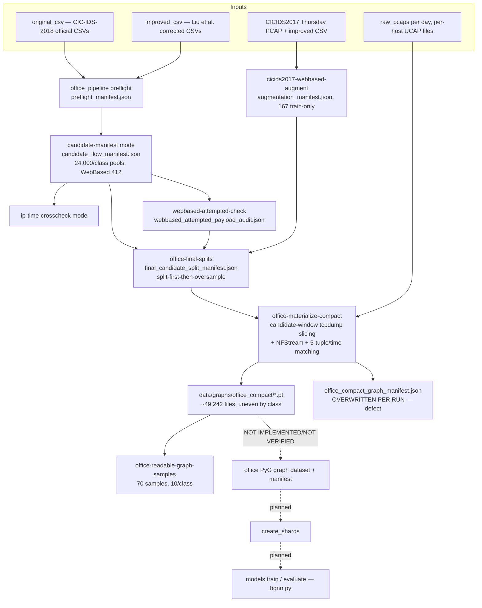
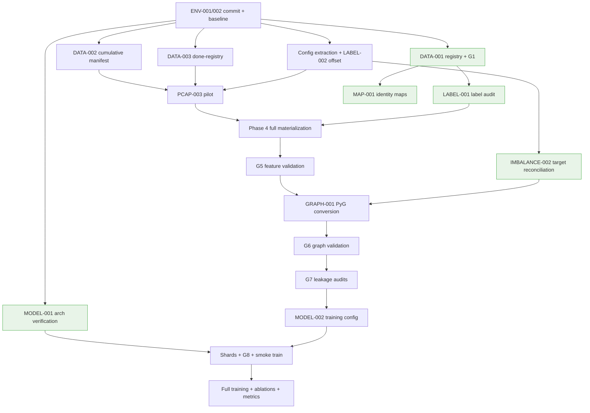

# SecureEdge CIC-IDS-2018 Office Pipeline — Project Recovery and Implementation Plan

**Document:** `docs/PROJECT_RECOVERY_AND_IMPLEMENTATION_PLAN.md`
**Date:** 2026-07-16
**Scope:** CIC-IDS-2018 "office model" track of the EC499 SecureEdge project (repo root `/var/home/alucard-00/EC499`)
**Primary input:** `docs/CIC_IDS_2018_PREPROCESSING_AND_GRAPH_GENERATION_REPORT.md` (the "Codex report"), 1,413 lines, dated 2026-07-16
**Companion context:** established project decisions from prior working sessions (triple-source labeling discipline, 4-hour timestamp offset, payload-retention audit, revised WebBased augmentation policy, split-first-then-oversample rule, XG-NID/GNN4ID architecture verification)

---

## Evidence classification convention

This plan was produced **without direct filesystem access to the repository**. Every factual claim is therefore tagged with its evidence tier:

| Tag | Meaning | Trust level |
| --- | --- | --- |
| **[R]** | Stated in the Codex report, with quoted code/artifact evidence | High, but repo-unverified by this plan's author |
| **[R-w]** | Stated in the Codex report without quoted evidence (narrative claim) | Medium |
| **[P]** | Established in prior working sessions and verified at that time against primary sources (PCAPs, CSVs, GNN4ID repository code) | High for the time it was verified; current code state must be re-checked |
| **[I]** | Technical inference from [R]/[P] facts | Judgement |
| **[D]** | Proposed design decision made by this plan | Decision, not fact |
| **[V]** | **Requires direct validation in the repository before acting** | Unverified |

Wherever the Codex report and prior-session decisions conflict, the conflict is stated explicitly and tagged [V]. Nothing in this plan invents dataset files, counts, mappings, or results; all numbers trace to the Codex report or prior-session records.

---

## 1. Executive assessment

### 1.1 Current condition

The project is **not broken; it is incomplete and under-governed at scale.** [I]

The office pipeline has already solved the hard conceptual problems:

- Candidate selection from labeled CSVs works: 24,000-candidate pools exist for six of seven classes, and the final split manifest implements split-first-then-oversample with a leakage guard (no CICIDS2017 in val/test, no real-candidate cross-split identity overlap). [R]
- The formerly zero-yield classes (BruteForce, DoS, DDoS) were unblocked by candidate-window PCAP slicing: 200 / 165 / 20 compact graphs prove the matching path is correct end to end. [R]
- All seven classes have readable graph samples (70 total, 10/class), and smoke checks pass. [R]
- The compact-graph → PyG → shard → train → evaluate chain is fully implemented and battle-tested on the IoT track, which reached macro F1 = 0.952 (Run 21). [P]

What remains is an **engineering-at-scale problem, not a design problem**: only ~49,242 office compact graphs exist against a nominal target of 7 × 24,000 = 168,000 candidate references [R], the materialization manifest is overwritten per run so progress cannot be audited [R], the core pipeline file is untracked in git [R], and the WebBased class is intrinsically scarce (412 native samples) [R][P].

### 1.2 Is the Codex report accurate?

Largely yes. It is internally consistent (its WebBased arithmetic checks out: 412 native = 206 train + 103 val + 103 test; 373 real train = 206 native + 167 CICIDS2017, matching the payload-audit outcome from prior sessions [P]). It correctly refuses to invent counts it did not measure, and it flags its own verification gaps.

It has **four material discrepancies or omissions** against previously verified project facts, detailed in §2. The two most consequential:

1. It reports `hgnn.py` as using `GATv2Conv` [R-w], while the project's verified conclusion — confirmed by reading the actual GNN4ID repository — is that XG-NID uses **SAGEConv**, and the Run 21 IoT model was corrected to SAGEConv. [P] Either the office track would train on a non-replication architecture, or the report described stale/parallel code. **[V] — this must be resolved before any office training run.**
2. It never mentions the confirmed **4-hour timestamp offset** between the official CIC-IDS-2018 schedule and the CSV data. [P] Since candidate→PCAP matching has succeeded for all classes, the offset is presumably handled somewhere in `office_pipeline.py` [I], but it is undocumented in the report and must be surfaced into configuration. [V]

### 1.3 Verdict and classification

| Question | Answer |
| --- | --- |
| Is graph generation currently possible? | Yes — proven for all seven classes at small scale [R]; not yet at full scale |
| Are generated graphs currently trustworthy? | Structurally yes (smoke checks + readable samples pass [R]); *population*-trustworthy only after cumulative-manifest reconciliation and Gate 6 validation (§19) |
| Should model training begin now? | **No.** Training on the current compact pool would train on a class distribution (20 DDoS vs 23,509 Infiltration) that reflects materialization progress, not the designed split |
| Recovery strategy | Complete and industrialize the existing pipeline; do **not** redesign graph semantics |
| Highest-priority action | Commit `office_pipeline.py` to git + build the cumulative materialization manifest (both zero-risk, both prerequisites for everything else) |

**Classification: Moderate refactoring.** Not minor correction (state management, config externalization, and a scaled materializer must be built). Not major refactoring or reconstruction (candidate selection, labeling, slicing, matching, graph construction, and training code are correct and proven; the flow-centric graph design is the *deliberately correct* design for an XG-NID replication and must not be replaced by a time-window redesign — see §10.1).

---

## 2. Review of the Codex report

### 2.1 Strengths

- Correctly separates the two pipelines (IoT/original vs office) and identifies the office track as the continuation path.
- Quotes real code (`assert_full_run_is_allowed`, `build_compact_graph_record`, preflight blockers) with file/line references (Appendix D of the report), making its central claims checkable.
- Honest about its own gaps: explicitly lists checksums, packet counts, IP/MAC conflict tables, and external documentation as unverified.
- The per-problem tables (Problems 1–10) correctly identify root causes rather than symptoms for the memory and materialization issues.
- Its class-count tables distinguish the unit (candidate row vs compact file vs graph) — a distinction this project has been burned by before.

### 2.2 Weaknesses

- Reports architecture and filtering behavior that conflicts with verified prior decisions without noting the conflict (it could not know about the prior sessions; nonetheless the claims need resolution).
- Omits the 4-hour timestamp offset and never names the improved CSVs as the Liu et al. corrected-label dataset, obscuring the triple-source labeling discipline that governs this project.
- Recommends a mode flag list "to be confirmed with `--help`" — the exact office CLI surface is therefore [V].
- Offers a generic balancing-methods table without committing to one strategy (this plan commits in §11).
- Does not quantify materialization *yield* (matched candidates ÷ attempted candidates), which is the single number that determines whether full targets are achievable.

### 2.3 Claim verification table

| Codex finding | Verification result | Evidence | Impact on solution plan |
| --- | --- | --- | --- |
| Office pipeline centered in untracked `secureedge/data/office_pipeline.py` | **Confirmed-consistent** [R]; matches prior-session working pattern [P] | Report §5, Appendix E | P0 task: commit it (ENV-001) |
| Compact counts: Benign 10,764 / BruteForce 200 / DoS 165 / DDoS 20 / WebBased 412 / Bot 14,172 / Infiltration 23,509 | **Codex-reported (filesystem count)** [R]; plausible vs prior sessions | Report §14 | Defines the materialization gap that Phase 4 must close |
| Final split manifest: 20,000/2,000/2,000 per class; WebBased 373 real train → 6,000 target, 103/103 val/test | **Confirmed-consistent with payload-audit arithmetic** [P]; but 6,000 target **conflicts** with the revised 3,500–5,000 policy (~10–15× of real pool) [P] | Report §14; prior-session augmentation decision | IMBALANCE-002: reconcile manifest target with documented policy before rebuilding splits |
| `hgnn.py` uses `HeteroConv` + `GATv2Conv` | **Conflicts with prior verified fact** that the validated architecture is SAGEConv (per GNN4ID source) [P] | Report §2, §16 vs prior GNN4ID code reading | **[V] MODEL-001 (P0 for training):** inspect `hgnn.py`; if GATv2Conv is current, either the Run 21 SAGEConv change lives elsewhere or was lost — resolve before office training |
| Original pipeline applies class-conditional MAC filtering in `extract_worker.py` | **Conflicts with prior decision** that uniform MAC filtering matches XG-NID and class-conditional filtering was an unjustified deviation [P] | Report §10 vs prior-session decision record | **[V] MAP-002:** confirm which behavior is live; office pipeline uses candidate/tuple matching instead [R], so this mainly affects IoT-track consistency and the thesis methodology chapter |
| No mention of 4-hour schedule↔CSV timestamp offset | **Omission**; offset is a confirmed project fact [P] | Prior-session timestamp audit | LABEL-002: offset must become an explicit, documented config value with a validation check |
| `improved_csv/CSE-CICIDS2018_improved/` used for candidate selection | **Confirmed-consistent**; this is the Liu et al. corrected-label distribution [P] | Report §7; prior-session labeling discipline | Naming must be made explicit in config + docs (triple-source discipline) |
| Manifest overwritten per materialization run (non-cumulative) | **Codex-reported with artifact evidence** [R] | Report Problem 6 | P0 task DATA-002 |
| Memory guard exists because full runs exhausted RAM/swap | **Confirmed** (code quoted) [R]; consistent with prior experience [P] | Report §8 code block | Target architecture keeps guards; adds slicing-first invariant |
| DDoS endpoint PCAP ≈ 18 GB; recovery via ~18 MB candidate-window slice | **Codex-reported** [R] | Report Problem 4 | Sets slicing parameters for Phase 4 |
| `artifacts/metrics.json` absent; model performance unverifiable from repo | **Confirmed for the artifact** [R]; but IoT-track Run 21 macro F1 = 0.952 exists in project history [P] | Report Problem 9; prior-session record | ENV-003: regenerate and persist metrics with manifest hashes; report should not be read as "no metrics ever existed" |
| Leakage guards present; split-first-then-oversample implemented | **Confirmed-consistent** [R][P] — this was the Run 13 lesson (false 0.987 from oversample-before-split) | Report §1, §19; prior-session leakage post-mortem | Retain; extend with Gate 7 audits |
| Readable samples 70 (10/class); smoke checks pass | Codex-reported [R] | Report §19 | Baseline for regression tests |
| No project-owned notebooks/shell scripts | Codex-reported [R-w] | Report §5 | Simplifies migration map |
| Exact office CLI mode flags | **Unconfirmed by Codex itself** | Report §24 caveat | [V] Confirm with `--help` before writing runbooks |

### 2.4 Findings Codex missed

| Missing finding | Why it matters |
| --- | --- |
| 4-hour timestamp offset (schedule vs CSV) [P] | Any new timestamp-window validation code that ignores it will silently mismatch |
| Liu et al. identity of `improved_csv` and the triple-source labeling hierarchy [P] | The label-source hierarchy (§8.5) is a core methodological claim of the thesis |
| Payload-retention audit methodology (+64 recovered CIC-IDS-2018 WebBased attempted samples; ~167 usable CICIDS2017 after audit collapse from ~2,000–2,300 projected) [P] | Explains *why* WebBased counts are what they are; must be reported in the thesis |
| Materialization yield rate as the key planning number | Without measured yield, "complete 20,000/class" is an assumption, not a plan (fixed in Phase 4 pilot) |
| Whether the office track's per-class 24,000 candidate pools were drawn with the same proportional split ratio discipline as the IoT track | [V] SPLIT-002 audit |

---

## 3. Current architecture reconstruction

Reconstructed from the Codex report's code quotes, artifact tables, and command list; consistent with prior sessions. Items marked [V] could not be confirmed.



Per-stage status:

| Stage | File | Input | Output | Status | Failure point | Disposition |
| --- | --- | --- | --- | --- | --- | --- |
| Preflight | `office_pipeline.py` | day specs, dataset dirs | `preflight_manifest.json` | Implemented [R] | Stale blocker text [R] | **Retain**, refresh text, externalize day specs |
| Candidate manifest | `office_pipeline.py` | improved/original CSVs | `candidate_flow_manifest.json` | Implemented [R] | — | **Retain** |
| IP/time crosscheck | `office_pipeline.py` | CSVs, windows | crosscheck artifact | Implemented [R] | Offset handling undocumented [P][V] | **Retain**, document offset in config |
| WebBased payload audit | `office_pipeline.py` | PCAPs, labels | `webbased_attempted_payload_audit.json` | Implemented [R][P] | — | **Retain** (methodological asset) |
| CICIDS2017 augmentation | `office_pipeline.py` | 2017 Thursday PCAP/CSV | augmentation manifest (167) | Implemented [R][P] | — | **Retain** |
| Final splits | `office_pipeline.py` | candidates + augmentation | `final_candidate_split_manifest.json` | Implemented [R] | 6,000 vs 3,500–5,000 policy conflict [P] | **Retain**, reconcile target (IMBALANCE-002) |
| Compact materialization | `office_pipeline.py` (+ `pcap_flows.py`) | splits + PCAPs | compact `.pt` files | **Partial** [R] | Scale: memory, yield, no resume registry, manifest overwrite | **Rewrite the orchestration layer** (keep matcher + slicer + NFStream wrapper) |
| Readable samples | `office_pipeline.py` | compact files | samples manifest | Implemented [R] | — | **Retain** |
| Office PyG conversion | not verified [R] | compact files | `.pt` HeteroData + manifest | **Missing/unverified** [V] | Does not exist as an office command | **Create** (thin adapter over `build_graphs.py`/`graph_builder.py`) |
| Sharding | `create_shards.py` | graph files | shards | Implemented (IoT) [R] | Needs office manifest | **Reuse** with `--manifest` parameter |
| Training/eval | `train.py`, `hgnn.py` | shards | checkpoint, metrics | Implemented (IoT) [R] | Architecture discrepancy [V]; 7-class mapping needed | **Reuse** after MODEL-001 resolution |

**Conflicting-pipeline determination:** two pipelines exist by design (IoT vs office), not by accident. Within the office track there is exactly one implementation (`office_pipeline.py`); the canonical-version question does not arise at the pipeline level, only at the module level after the §14 refactor. The original `preprocess.py`/`extract_worker.py` reservoir path is **not** used by the office track [R] and must not be "merged" into it — its MAC-filtering semantics belong to the IoT dataset.

---

## 4. Target architecture

**Principle [D]:** the target architecture is the *current* architecture with three additions — durable state management, externalized configuration, and validation gates — plus one rewritten layer (the materialization orchestrator). Graph semantics, feature schemas, the NFStream extraction core, and the training stack are retained deliberately: they replicate XG-NID and are already validated on the IoT track (macro F1 = 0.952 [P]).

```mermaid
flowchart TD
    A[Dataset Registry\nregistry.py — inventory, sizes, checksums] --> B[Gate 1: Raw data validation]
    B --> C[CSV Label Audit\ntriple-source: original + Liu et al. + IP/time windows]
    C --> D[Gate 2/4 inputs: label-count + timestamp-offset report]
    D --> E[Candidate Flow Manifest\nEXISTING candidates.py logic]
    E --> F[WebBased payload audit + CICIDS2017 augmentation\nEXISTING]
    F --> G[Final Split Manifest\nEXISTING, target reconciled to policy]
    G --> H[Gate 7a: candidate-level split leakage audit]
    H --> I[Materialization Orchestrator — NEW\nper-class, time-bucketed, resumable]
    I --> I1[tcpdump candidate-window slicer\nEXISTING logic, parameterized]
    I1 --> I2[Worker-isolated NFStream extraction\nEXISTING pcap_flows.py, RSS-capped subprocess]
    I2 --> I3[Bidirectional 5-tuple + timestamp matcher\nEXISTING logic]
    I3 --> J[Compact graph records + per-run manifest]
    J --> K[Cumulative Materialization Manifest — NEW\nappend-only, done-registry]
    K --> L[Gate 5/6: compact + feature validation]
    L --> M[Office PyG Conversion — NEW thin command\nreuses graph_builder.compact_to_hetero_graph]
    M --> N[Gate 6: graph structural validation]
    N --> O[create_shards — EXISTING]
    O --> P[Gate 7b: graph-level leakage + source audit]
    P --> Q[Gate 8: model-loader smoke test]
    Q --> R[HGNN training — EXISTING, arch verified per MODEL-001]
    R --> S[Evaluation: macro metrics, per-class,\nWebBased source-stratified + Wilson CIs]
```



Stage contracts (only stages that are new or changed; retained stages keep their current contracts):

| Stage | Responsibility | Input | Output | Error handling | Logging | Resume |
| --- | --- | --- | --- | --- | --- | --- |
| Dataset registry | Enumerate every dataset file with size, sha256, packet count (PCAPs), row count (CSVs) | `datasets/` tree | `artifacts/office_model/dataset_registry.json` | Missing file → recorded as `missing`, gate fails | JSONL per file | Skip files whose (path, size, mtime) already registered |
| Materialization orchestrator | Drive per-class batch materialization to split targets | final split manifest, dataset registry, done-registry | compact files + per-run manifests | Failed batch → recorded with reason code, batch re-queued up to `max_retries`, then `deferred` | JSONL per batch: candidates attempted/matched/unmatched/failed, RSS peak, wall time | Done-registry keyed by `candidate_id`; idempotent re-runs |
| Cumulative manifest | Single source of truth for materialized state | per-run manifests | `office_compact_cumulative_manifest.json` (+ per-run files retained) | Rebuildable from filesystem scan (`--reconcile`) | Class counts on every update | Append-only; reconcile mode heals drift |
| Office PyG conversion | compact → `HeteroData` `.pt` per split, fit scaler on train only | cumulative manifest + split manifest | `data/graphs/office_{train,val,test}/`, `office_graph_dataset_manifest.json`, scaler | Bad record → quarantined to `rejected/` with reason | counts, dims, scaler hash | Skips already-converted graph IDs |
| Validation gates | §19 | stage outputs | machine-readable `gate_reports/*.json` + human summary | Gate failure blocks next stage unless `--force` with logged justification | pass/warn/fail per check | Stateless |

Non-functional requirements satisfied by this design: modular (one module per stage, §14), reproducible (config + checksums + manifests + seeds), configurable (§15), scalable and memory-efficient (slice-first invariant: **NFStream never opens a file larger than `max_slice_mb`** [D]), testable (§18), resumable (done-registry + append-only manifests), corruption-resistant (quarantine + reason codes), schema-explicit (§8), PyG-compatible (unchanged graph format).

---

## 5. Root-cause analysis

| Root cause | Symptoms caused | Affected files | Severity | Required architectural correction |
| --- | --- | --- | --- | --- |
| **RC1 — Scale mismatch: whole-endpoint PCAP scanning vs multi-GB per-host captures** (NFStream + payload capture over 4–18 GB files) [R][P] | Memory/swap exhaustion; safety guards blocking full runs; BruteForce/DoS/DDoS at 0 graphs until slicing; DDoS still at 20 | `pcap_flows.py`, `preprocess.py`, `extract_worker.py`, `office_pipeline.py` | Critical | Slice-first invariant + RSS-capped worker subprocesses + time-bucketed batches (§8.2, Phase 4) |
| **RC2 — Run-scoped instead of dataset-scoped state** (manifest overwritten per run; no done-registry; progress only countable by `find`) [R] | Non-cumulative manifest; unauditable progress; risk of duplicate or skipped candidates on re-run | `office_pipeline.py` materialization modes | Critical | Append-only cumulative manifest + candidate done-registry + reconcile mode (DATA-002/003) |
| **RC3 — Configuration embedded in code and outside version control** (hard-coded day specs, windows, endpoint roles; `office_pipeline.py` untracked; env-var sprawl) [R] | Reproducibility risk; collaborators/fresh clones lack core pipeline; timestamp offset invisible | `office_pipeline.py`, `config.py`, git working tree | Critical (the untracked file), High (rest) | Commit code; extract `configs/office_cic_ids_2018.yaml`; typed config loader (§15) |
| **RC4 — Intrinsic dataset scarcity of WebBased traffic** (412 native candidates; audit-verified ceiling [P]) | 103-sample val/test; unstable WebBased metrics; augmentation/oversampling machinery and its policy drift (6,000 vs 3,500–5,000) | split manifests, training config | High | §11 strategy: exhaust native evidence, train-only 2017, policy-compliant oversample, weighted loss, stratified reporting with CIs |
| **RC5 — Validation applied ad hoc rather than as gates** (smoke checks exist; no per-stage gates; no checksums; no yield accounting; office PyG conversion unverified) [R] | Cannot certify graph population; unknown materialization yield; metrics artifact absent | `tests/smoke_checks.py`, absent validators | High | Gate framework (§19) + tests (§18) |
| **RC6 — Dual-pipeline documentation drift** (README describes IoT track; office knowledge lives in 20+ context notes, several untracked) [R] | Wrong-pipeline risk; onboarding cost; report/manifest text staleness | `README.md`, `Project Context.md`, `context/*` | Medium | Office runbook + maintained plan/report; commit context notes (ENV-002) |

Mapping of visible failures → root causes: zero-graph BruteForce/DoS/DDoS episode ← RC1 (+RC5 for late detection); "only 20 DDoS graphs" ← RC1; "can't tell how many graphs we truly have" ← RC2; "fresh clone can't run office pipeline" ← RC3; "WebBased F1 will be unstable" ← RC4; "can't start training defensibly" ← RC2+RC4+RC5.

---

## 6. Master problem register

Severity: C=Critical, H=High, M=Medium. All problems below are confirmed by report evidence [R], prior sessions [P], or both, unless tagged [V].

| ID | Problem | Root cause | Component | Sev | Current effect | Proposed solution | Depends on | Validation |
| --- | --- | --- | --- | --- | --- | --- | --- | --- |
| ENV-001 | `office_pipeline.py` untracked in git [R] | RC3 | git | C | Core work absent from history; loss risk | Review + `git add` + commit; tag `office-recovery-baseline` | — | `git status` clean for pipeline; file present in fresh clone |
| DATA-001 | No dataset inventory/checksums [R] | RC5 | datasets | H | Cannot prove input integrity | Build `dataset_registry.json` (path, bytes, sha256, pcap packet count via `capinfos`, csv rows) | ENV-001 | Registry covers 100% of files referenced by day specs |
| DATA-002 | Compact manifest overwritten per run [R] | RC2 | office artifacts | C | Progress unauditable | Append-only cumulative manifest + retained per-run manifests with run IDs | ENV-001 | Cumulative counts == `find data/graphs/office_compact -name '*.pt' \| wc -l` per class |
| DATA-003 | No candidate done-registry → re-runs may duplicate/skip [I from R] | RC2 | materializer | C | Resume unsafe | Done-registry keyed by stable `candidate_id` (day + bidirectional 5-tuple + CSV start-ts) | DATA-002 | Re-running a completed batch produces 0 new files |
| PCAP-001 | Whole-endpoint NFStream scans exhaust memory (4.1–18 GB files) [R] | RC1 | `pcap_flows.py` callers | C | Full materialization blocked | Enforce slice-first invariant; RSS-capped worker; `max_slice_mb` config | DATA-003 | No worker opens file > `max_slice_mb`; RSS peak logged < cap |
| PCAP-002 | DDoS day: broad slices still too large [R] | RC1 | slicer | H | DDoS at 20 graphs | Narrow per-bucket windows (report shows ~18 MB slice succeeded) + 5-tuple BPF filters; batch merge | PCAP-001 | DDoS materialized count reaches decided target (§11/§27) |
| PCAP-003 | Materialization yield unmeasured | RC5 | materializer | H | Targets are assumptions | Pilot: 500 candidates/class → measured yield%, time/candidate, MB/candidate | PCAP-001 | Yield report exists; targets re-derived from it |
| LABEL-001 | Candidate-label assumptions not fully validated vs triple-source discipline [R][P] | RC5 | candidates | H | Silent label error risk | Label audit: per-day counts under original CSV vs Liu et al. vs IP/time windows; discrepancy report | DATA-001 | Discrepancies enumerated; resolution rule recorded per class |
| LABEL-002 | 4-hour timestamp offset undocumented in code/config [P][V] | RC3 | crosscheck, matcher | H | Future code may mismatch silently | Locate current handling [V]; lift into `timestamp_offset_hours: 4` config with per-day validation check | ENV-001 | Crosscheck reproduces known offset; config value asserted in Gate 4 |
| MAP-001 | No per-day IP↔MAC map or conflict report [R] | RC5 | identity | M | Endpoint ambiguity unquantified | Generate `ip_mac_map_by_day.json` (IP, MAC, first/last ts, pkt count, role, confidence) + conflict tables | DATA-001 | Conflicts (1 IP↔n MAC, 1 MAC↔n IP, gateway reuse) enumerated per day |
| MAP-002 | Class-conditional vs uniform MAC filtering discrepancy (IoT track) [R vs P] | RC6 | `extract_worker.py` | M (office), H (thesis) | Methodology chapter risk | Inspect live code [V]; align to uniform filtering (XG-NID-faithful) or document deviation | ENV-001 | Code behavior matches documented methodology |
| FEATURE-001 | Compact schema (92 flow feats, 1500 bytes, edge dims) asserted only by spot checks [R] | RC5 | graph records | H | Dim mismatch would surface at training | Gate 5 validator over the full compact pool (dims, NaN/Inf, dtype) | DATA-002 | 100% of pool passes or is quarantined with reasons |
| GRAPH-001 | Office compact→PyG conversion missing/unverified [R][V] | RC5 | conversion | C | Cannot produce trainable dataset | `office-build-graphs` command wrapping existing `compact_to_hetero_graph` + train-only scaler + manifest | FEATURE-001 | Round-trip load of every split; dims match manifest |
| GRAPH-002 | No structural validation of full graph population [R] | RC5 | validation | H | Empty/dup/NaN graphs undetected | Gate 6 validator (§10.7 checks) | GRAPH-001 | Validator report all-pass |
| IMBALANCE-001 | WebBased native scarcity: 412 pool, 103/103 val/test [R][P] | RC4 | dataset | H | Unstable WebBased metrics | §11 strategy (committed) | LABEL-001 | Strategy implemented; stratified metrics + CIs produced |
| IMBALANCE-002 | Split-manifest oversample target 6,000 conflicts with revised 3,500–5,000 policy [R vs P] | RC4/RC6 | split manifest | M | Methodology inconsistency | Rebuild split refs at policy-compliant target (recommend 4,500 ≈ 12× of ~373; or re-justify 6,000 in writing) | ENV-001 | Manifest target ∈ documented policy; context note updated |
| SPLIT-001 | Graph-level (post-materialization) leakage audit absent [R] | RC5 | splits | H | Only candidate-level guard exists | Gate 7b: hash-identity check across split graph dirs; window-overlap check; source tags | GRAPH-001 | Zero cross-split identity matches |
| SPLIT-002 | Office split-ratio discipline vs IoT proportional rule unaudited | RC5 | splits | M | Possible inconsistency with Run-13 lesson | Audit manifest: confirm split before oversample, per-class proportions | ENV-001 | Audit note committed |
| MODEL-001 | GATv2Conv (report) vs SAGEConv (verified XG-NID) discrepancy [R vs P][V] | RC6 | `hgnn.py` | C (for training) | Office model may not replicate XG-NID | Inspect `hgnn.py`; restore/port SAGEConv config used in Run 21; make conv type a config field | ENV-001 | Architecture printout matches Run-21 record; unit test asserts conv class |
| MODEL-002 | 7-class office mapping absent from training config [R] | RC3 | `train.py` config | H | Training would use 8-class IoT mapping | Office training config with `OFFICE_CLASS_NAMES`, class weights, loader paths | GRAPH-001 | Smoke train run logs 7 classes, correct names |
| ENV-002 | Context notes 64–86 partly untracked [R] | RC3/RC6 | context/ | M | Decision history loss risk | Commit; index them in office runbook | ENV-001 | All context notes tracked |
| ENV-003 | `metrics.json` absent [R] | RC5 | artifacts | M | Repo can't prove performance | Re-run IoT eval (optional) and office eval (Phase 11) persisting metrics + manifest hashes | MODEL-002 | metrics.json regenerated with provenance fields |
| TEST-001 | Only monolithic smoke checks exist [R] | RC5 | tests/ | M | Regressions undetected | §18 test suite | ENV-001 | CI-style local run passes |


---

## 7. Dataset inventory and selection correction

All rows below derive from the Codex report's day table [R] and prior-session dataset knowledge [P]. Byte-exact inventory requires DATA-001.

| Date | Dataset | Attack types → project class | Benign available | Local PCAP | Local labels/CSV | Compact graphs now | Required action |
| --- | --- | --- | --- | --- | --- | ---: | --- |
| Wed 14-02-2018 | CIC-IDS-2018 | FTP/SSH brute force → BruteForce | Yes | Yes (per-host UCAP set) [R] | original + improved (Liu et al.) [R] | 200 | Full materialization to target (Phase 4) |
| Fri 16-02-2018 | CIC-IDS-2018 | DoS (Hulk etc.) → DoS | Yes | Yes; includes 4.1 GB `UCAP172.31.69.25-part1` [R] | Yes | 165 | Full materialization |
| Wed 21-02-2018 | CIC-IDS-2018 | DDoS (LOIC etc.) → DDoS | Yes | Yes; 18 GB `UCAP172.31.69.28 part 1` [R] | Yes | 20 | Full materialization with narrow windows (PCAP-002) |
| Thu 22-02-2018 | CIC-IDS-2018 | Web attacks → WebBased | Yes | Yes | Yes | 412 (both web days combined) [R] | All native candidates already materialized [R]; verify vs payload-audit recoveries (+64) [P][V] |
| Fri 23-02-2018 | CIC-IDS-2018 | Web attacks → WebBased | Yes | Yes | Yes | (in 412) | as above |
| Thu 01-03-2018 | CIC-IDS-2018 | Infiltration → Infiltration | Yes | Yes | Yes | 23,509 | Reconcile vs 24,000-candidate split; validate coverage per split |
| Fri 02-03-2018 | CIC-IDS-2018 | Bot → Bot | Yes | Yes | Yes | 14,172 | Complete to target |
| (all days) | CIC-IDS-2018 | Benign | — | Yes | Yes | 10,764 | Complete to target (cheapest class: benign flows are everywhere; slice by candidate windows on already-downloaded days) |
| Thu 2017 | CICIDS2017 | Web attacks (train-only aug) | n/a | Yes, 8.3 GB Thursday PCAP [R] | improved Thursday CSV [R] | 167 candidates (materialization state [V]) | Confirm 2017 candidates are materialized as compact graphs, not only referenced |

**Missing days / additional downloads:** Two CIC-IDS-2018 days carry attack traffic not in the seven-class design (e.g., Thu 15-02 DoS GoldenEye/Slowloris, Fri 23-02 second web day is already included, Fri 02-03 bot). Specifically relevant: **Thu 15-02-2018 (DoS: GoldenEye, Slowloris)** could enlarge the DoS pool, and **no additional CIC-IDS-2018 web-attack day exists beyond 22–23 Feb** — the WebBased ceiling is a property of the dataset, consistent with the prior payload-audit conclusion [P]. Decision [D]: **no new downloads are required to meet the seven-class design.** Optionally download Thu 15-02 only if DoS materialization yield (PCAP-003 pilot) proves too low to reach target from Fri 16-02 alone. Everything else needed is local.

Unit discipline reminder (a recurring project hazard): every count in this section is either a *candidate row* or a *compact graph file*; neither equals CSV rows, NFStream flows, or PyG graphs. Every future report must state its unit (as the Codex report correctly demands [R]).

---

## 8. Preprocessing redesign

Design stance [D]: stages 8.1–8.6 are **hardening of existing behavior**, not reinvention. The only new implementation of substance is the orchestration/state layer.

### 8.1 PCAP validation (new: `secureedge/office/registry.py`)

| Item | Spec |
| --- | --- |
| Purpose | Gate 1 input integrity |
| Existing | None (Codex confirms no checksums/packet counts) [R] |
| Implementation | For each file in day specs: existence, size, sha256, `capinfos -c -e -a -u` (packet count, first/last ts, duration), link-layer type via `capinfos -i`/tshark, truncation flag (capinfos error or `tcpdump -r` tail read), readability (open + read first 1,000 packets) |
| Output schema | JSON list: `{path, bytes, sha256, packets, ts_first, ts_last, linktype, truncated: bool, readable: bool, error: str?}` |
| Failure handling | Per-file errors recorded; Gate 1 fails if any *required* file (referenced by split manifest candidates) is missing/unreadable; truncated files flagged warn (per-host captures may legitimately end mid-flow) |
| Tests | Unit: sha256 + capinfos parsing on a fixture PCAP; Integration: registry over `tests/fixtures/mini_day/` |
| Acceptance | 100% of referenced files registered; zero unexplained `error` entries |

CSV validation analog: row count, header schema match against expected Liu et al./original column sets, label-value vocabulary check, timestamp parse rate.

### 8.2 Streaming packet extraction — tool decision

| Tool | Verdict | Reason |
| --- | --- | --- |
| **NFStream (retain)** | **Primary** [D] | It is XG-NID/GNN4ID's own extraction layer [P]; produces the exact 92-feature flow vector + payload capture the graphs are built on; replacing it invalidates replication fidelity and the IoT-track comparability |
| tshark/PyShark | Rejected as primary | Different feature definitions; PyShark is slow and leaky at scale |
| Scapy/dpkt | Rejected | Would require reimplementing flow metering NFStream already provides |
| Zeek | Rejected | Excellent flow logs, but wrong feature schema for XG-NID replication |
| **tcpdump (retain as pre-filter)** | Auxiliary [D] | Already used for candidate-window slicing [R]; it is the memory-safety mechanism |

Memory safety is achieved **around** NFStream, not inside it: the slice-first invariant guarantees NFStream only ever sees candidate-window slices (`max_slice_mb`, default 256 MB [D], tune from pilot), inside a subprocess with an RSS ceiling (`resource.setrlimit(RLIMIT_AS)` + existing memory checks [R]). This formalizes what the targeted recovery already proved works (18 GB → 18 MB slice → 20 DDoS graphs) [R].

### 8.3 Packet normalization — canonical packet record

Already defined implicitly by `pcap_flows.py`/`graph_builder.py` [R]. Make it explicit (documented dataclass, not a behavior change):

```text
packet_record:
  timestamp_ms: float        # epoch ms
  direction: int             # 0 = src→dst (flow orientation), 1 = reverse
  ip_size: int
  transport_size: int
  payload_size: int
  payload: bytes             # truncated/padded to N_PACKET_FEATURES = 1500 at graph build
```

Fields like MACs and ports live at flow level (candidate + NFStream flow record), not per packet — retained as-is; adding per-packet identity fields would only create leakage surface (§9).

### 8.4 Flow reconstruction

Retain NFStream semantics (bidirectional flows, its default active/idle timeouts, `decode_tunnels=False`, `n_dissections=0`, `FLOW_PACKET_LIMIT` packet capture) [R]. One addition [D]: **record the NFStream timeout parameters into the run manifest** so the matching tolerance (§8.5) is interpretable. Do not change timeouts mid-project — it would silently redefine what a "flow" is relative to already-materialized graphs; if a change is ever needed, it requires full re-materialization (state this in config as a frozen field).

### 8.5 Label association — the triple-source hierarchy

This is the project's core methodological asset [P]. Codify it:

**Label-source hierarchy (highest trust first):**

1. **IP + time-window ground truth** — attacker/victim endpoint IPs and per-day attack windows from the official schedule, **with the confirmed +4 h offset applied to CSV-side timestamps** [P]. This is the arbiter when sources disagree.
2. **Liu et al. corrected labels** (`improved_csv/CSE-CICIDS2018_improved`) — primary machine label source for candidate selection [R][P].
3. **Original CSV labels** — cross-check only; known to contain labeling errors (motivation for Liu et al.) [P].

**Matching method hierarchy (candidate → PCAP-derived flow):**

| Order | Method | Rule |
| --- | --- | --- |
| 1 | Exact bidirectional 5-tuple + start-timestamp within tolerance `τ` | Accept |
| 2 | Reverse-direction 5-tuple + `τ` | Accept, record `direction_flipped=true` |
| 3 | 5-tuple match, timestamp within `2τ` | Accept, record `ts_relaxed=true` (counts reported at Gate 4; if >5% of matches, investigate offset drift before continuing) |
| 4 | Multiple candidates match one flow | Deterministic tie-break: smallest |Δts|; ties → reject both, reason `ambiguous_match` (never guess a label) |
| 5 | No match | `unmatched`, reason-coded (`no_slice_traffic`, `outside_window`, `tuple_absent`) — reported, never silently dropped |

`τ` default: the value already in use in `office_pipeline.py` [V — confirm current value]; expose in config. Conflicting labels between Liu et al. and windows: window ground truth wins; log every override into `label_conflict_report.json` with both labels (these overrides are thesis material). Mixed benign/attack inside one candidate window: labels are **per-flow**, not per-window, so the window only scopes the *search*; a flow keeps its CSV/Liu label if the tuple matches — the window never overwrites a flow label except via the explicit conflict rule above. Unknown traffic in slices (non-candidate flows): ignored by design — the office pipeline is candidate-driven [R], which is correct for a labeled-supervised replication.

### 8.6 Missing and invalid values

| Case | Rule (retain unless noted) |
| --- | --- |
| Missing MAC | Not used for office matching [R]; record `mac_missing=true` in identity map (§9) |
| IPv6 | Out of scope for CIC-IDS-2018 candidate tuples; slicer BPF filters are IPv4; any IPv6 flow → `unmatched:tuple_absent` |
| ARP/ICMP/non-TCP-UDP | Not candidates (candidates come from flow CSVs); excluded upstream |
| NaN / ±Inf in flow features | Gate 5 hard-fail → quarantine record with reason (`nan_feature:<name>`); never impute silently [D] |
| Invalid ports (0 / >65535) | Reject candidate at manifest build; count reported |
| Malformed packets | NFStream/libpcap skip; slicer logs tcpdump stderr; packet-count delta reported per slice |
| Zero-packet matched flow | `build_compact_graph_record` returns `None` [R] — keep, but **count it** as `matched_no_packets` in the run manifest (currently a silent candidate/graph count divergence [R]) |

### 8.7 Feature engineering

No new features [D] — schema freeze for replication fidelity:

| Layer | Content | Leakage assessment |
| --- | --- | --- |
| Flow node (92 dims) | NFStream statistical features + temporal context features [R] | Verify no raw IP/port/MAC values are inside the 92 [V — FEATURE-002 audit]; identity values would enable memorization (§9) |
| Packet nodes (1,500 dims) | Raw payload bytes, zero-padded [R] | Payload can contain IPs/hostnames in text — acceptable and XG-NID-faithful, but note in thesis limitations |
| Edge attrs | flow↔packet: direction, ip_size, transport_size, payload_size; packet→packet: Δts [R] | Safe |
| Graph label | class index + subtype string [R] | — |
| Normalization | Scaler fit on **train split only**, persisted with hash (existing behavior on IoT track [R][P]) | Gate 8 asserts scaler provenance |

### 8.8 Intermediate formats

| Artifact | Format | Rationale |
| --- | --- | --- |
| Compact records | Existing torch `.pt` dicts, one per flow [R] | **Retain** — resumability at single-candidate granularity, already proven; switching to Parquet would force array-of-ragged-payload gymnastics for zero benefit |
| Manifests/registries | JSON (small) / JSONL (append-only logs) | Human-diffable, git-friendly |
| Label/audit tables | **Parquet** for large per-flow audit tables (label conflicts, match logs) [D] | Millions of rows; pandas-native; compressed |
| Naming | `office_compact/<Class>/<day>__<candidate_id>.pt`; runs `run_<UTCISO>__<mode>` | Sortable, collision-free |
| Versioning | Every manifest carries `schema_version`, `config_hash`, `git_commit` [D] | Reproducibility |

---

## 9. IP, MAC, and host-identity resolution

**Node semantics decision [D — reaffirming existing design]:** graph nodes are **flow + packets**, never hosts. Host identity (IP/MAC) is used for *selection and audit only*: choosing endpoint PCAPs, scoping attack windows, leakage audits [R]. This matches XG-NID [P] and avoids the identity-memorization failure mode. Consequently there is no host-node type to define; the heterogeneous types remain: `flow`, `packet`; edges `('flow','contains','packet')`, `('packet','of','flow')`, `('packet','next','packet')` [R].

Rules:

1. **Canonical host identifier** (for audits/manifests, not features): `day::ip` [D]. MACs are attached as attributes, not identity, because CIC-IDS-2018 per-host captures make IP-per-day stable while gateway MAC reuse is expected. Cross-day identity is deliberately *not* asserted (AWS-style address reuse makes it unsafe); the day-scoped key prevents false cross-day joins.
2. **Conflict handling** (MAP-001 audit): 1 IP ↔ n MACs within a day → likely gateway/L2 path difference; record all, confidence `low`, exclude from any role inference. n IPs ↔ 1 MAC → gateway MAC; flag `gateway=true`. Broadcast/multicast MACs and IPs: excluded from identity map; if they appear inside candidate flows, report count (they should not — candidates are unicast 5-tuples).
3. **Anonymization:** not needed (public research dataset) [D]. **Raw IP/MAC as model features: prohibited** [D]; FEATURE-002 audits the 92-dim vector to prove absence [V].

Pseudocode for the identity audit:

```python
def build_identity_map(day, pcap_slices):
    seen = {}  # ip -> {macs: Counter, ts_first, ts_last, pkts}
    for pkt in iter_headers(pcap_slices):        # headers only, no payload
        for ip, mac in ((pkt.src_ip, pkt.src_mac), (pkt.dst_ip, pkt.dst_mac)):
            if is_broadcast_or_multicast(ip, mac): continue
            e = seen.setdefault(ip, new_entry())
            e.update(mac, pkt.ts)
    conflicts = {ip: e for ip, e in seen.items() if len(e.macs) > 1}
    gateways  = macs_seen_with_many_ips(seen, threshold=cfg.gateway_ip_threshold)
    write_json(f"ip_mac_map_{day}.json", seen, conflicts, gateways)
```

MAP-002 (IoT-track MAC filtering discrepancy) is resolved separately: inspect `extract_worker.py` [V]; the office track does not use MAC filtering [R], so this is a methodology-consistency fix, not an office blocker.

---

## 10. Graph-generation specification

### 10.1 Graph unit — one graph per flow (retained, with justification)

The generic recovery template for projects like this often pushes toward time-window graphs. **Rejected here [D]:** SecureEdge is an XG-NID replication+extension; XG-NID's unit is the flow-with-packets heterogeneous graph [P], the IoT track validated it (macro F1 0.952) [P], the office candidate machinery is built around per-flow labels, and per-flow labeling sidesteps every mixed-label-window ambiguity the template worries about. Changing the unit would (a) break replication claims, (b) break IoT↔office cross-domain comparability (a planned experiment [P]), and (c) discard the working matcher. A time-window variant is at most a §28 ablation, never the mainline.

### 10.2 Node types (existing, frozen)

| Type | Identifier | Features | Label | Creation |
| --- | --- | --- | --- | --- |
| `flow` | candidate_id | 92-dim flow+temporal vector [R] | graph-level class carried here | 1 per graph |
| `packet` | index within flow | 1,500 payload bytes (uint8 → model-side encoding) [R] | none | first `FLOW_PACKET_LIMIT` packets |

### 10.3 Edge types (existing, frozen)

| Type | Direction | Features | Duplicates | Self-loops |
| --- | --- | --- | --- | --- |
| flow→packet `contains` | directed | direction, ip_size, transport_size, payload_size [R] | impossible by construction | forbidden (Gate 6 checks) |
| packet→flow `of` | directed (reverse) | mirror of above [R] | — | forbidden |
| packet→packet `next` | directed, temporal order | Δtimestamp [R] | forbidden | forbidden |

### 10.4 Temporal design

No windows in graph semantics (per §10.1). Temporal parameters that *do* exist: candidate-window **slicing width** (`preslice_time_window_seconds`, existing env var [R] → config) and matching tolerance `τ`. Validation of these values is empirical, not arbitrary: the PCAP-003 pilot sweeps slice width ∈ {current value, ½×, 2×} on one class and reports yield vs slice size vs wall time; pick the smallest width that preserves ≥99% of the wider width's match yield [D].

### 10.5 Label strategy

Graph-level, single-label, 7-class multiclass (`Benign, BruteForce, DoS, DDoS, WebBased, Bot, Infiltration`) [R]. Subtype string retained as metadata for stratified analysis [R]. Mixed-traffic ambiguity does not arise (per-flow labels, §8.5).

### 10.6 Graph storage

PyG `HeteroData` in `.pt` files, per-split directories, dataset manifest with class names, counts, feature dims, scaler path, `schema_version`, `config_hash`, `git_commit`, source tags (`cicids2018` | `cicids2017`) per graph ID list [R + D additions]. Shards via existing `create_shards.py` [R].

### 10.7 Graph validation (Gate 6 checklist)

Empty graphs; zero-edge graphs; isolated packet nodes; duplicate `next` edges; self-loops; feature-dim mismatches (≠92 / ≠1,500); NaN/Inf; label ∉ [0,6]; packet count ∈ [1, FLOW_PACKET_LIMIT]; per-split class distributions vs manifest; cross-split graph-identity hashes (leakage); source-tag distribution (no `cicids2017` outside train). Machine-readable report; any hard check failure blocks sharding.


---

## 11. Web-based attack class imbalance — committed strategy

### 11.1 Situation analysis

| Fact | Value | Unit | Source |
| --- | --- | --- | --- |
| Native CIC-IDS-2018 WebBased pool | 412 | candidate flows | split manifest [R]; consistent with payload-audit outcome incl. +64 recovered attempted-attack flows [P] |
| Split | 206 train / 103 val / 103 test | candidates | arithmetic from [R] |
| CICIDS2017 augmentation | 167 (train-only) | candidates | [R][P] — post-audit ceiling; the original ~2,000–2,300 projection collapsed under payload-retention audit [P] |
| Real train pool | 373 (206+167) | candidates | [R] |
| Current oversample target | 6,000 (~16×) | train references | [R] — **conflicts with revised policy of 3,500–5,000 (~10–15×)** [P] |
| Standard class pool | 24,000 | candidates | [R] |
| Imbalance cause | **Original dataset scarcity**, not selection/matching/windowing — established by the payload audit [P] and by "all native candidates materialized" [R] | | |

Key implication: there is **no more native data to get**. CIC-IDS-2018 has exactly two web-attack days, both included; the payload audit already recovered application-layer blocked attempts. Every remaining lever is statistical/methodological.

### 11.2 Option evaluation

| Method | Verdict | Reason / risk |
| --- | --- | --- |
| Download more CIC-IDS-2018 web data | **Rejected — impossible** | No further web-attack days exist [P]; the audit established the ceiling |
| Merge web subclasses (SQLi/XSS/brute-web) into one WebBased class | **Adopted (already done)** [R] | Keep subtype metadata for stratified reporting |
| CICIDS2017 augmentation, train-only | **Adopted (already done)**, keep at 167 | Post-audit ceiling; never in val/test (guard exists [R]) |
| Random oversampling of train refs | **Adopted at 10–15×**, i.e. target 4,500 [D] | Policy-compliant (IMBALANCE-002); split-first ordering already enforced [R][P] |
| Class-weighted cross-entropy | **Adopted** (weights = inverse effective real counts, computed from *real* pool sizes, not oversampled refs) [D] | Cheap, defensible; complements moderate oversampling |
| Focal loss | **Ablation only** (§28 E3) | May help; adds a hyperparameter (γ); don't stack untested tricks in the mainline |
| Balanced batch sampling | **Rejected for mainline** | Oversampled refs already balance batches approximately; stacking balanced sampling on top of 12× oversampling + class weights triple-counts the minority and invites overfitting to 373 real samples |
| Undersampling benign/majority | **Rejected** | Throws away signal; targets already cap majority classes at 20,000 |
| SMOTE | **Rejected** | Samples here are heterogeneous graphs with raw-byte packet nodes; interpolating payload bytes produces syntactically invalid non-traffic. On tabular flow vectors alone it would desynchronize flow features from their packets. Only conceivable post-hoc in embedding space — out of scope, high risk, no thesis benefit |
| Synthetic graph generation | **Rejected** | Unvalidatable for an academic replication; reviewer poison |
| Pretrain 2017 → fine-tune 2018 | **Ablation only** (§28 E5) | Cleaner framing than mixing, but doubles training pipeline work; not needed for the mainline claim |
| Threshold adjustment | Evaluation-time note only | Doesn't fix representation |
| Grouped split by day | **Rejected as split axis** (see §13) | Each attack class ≙ specific day(s); day-grouping would empty classes from splits. Documented as inherent CIC-IDS-2018 limitation instead |

### 11.3 Final committed strategy [D]

1. **Data:** all 412 native candidates (incl. payload-audit recoveries) + 167 CICIDS2017 train-only. No further acquisition.
2. **Subclasses:** merged into `WebBased`; subtype metadata retained for per-subtype recall reporting.
3. **Oversampling:** rebuild split refs at **4,500 train references** (~12× of 373), replacing the 6,000 target — or, if the 6,000 figure was a deliberate later revision, document that in a context note and keep it; either way manifest and policy must agree (IMBALANCE-002).
4. **Loss:** class-weighted cross-entropy, weights from real (pre-oversample) counts.
5. **Batching:** standard shuffled batches over the oversampled reference set (no additional balancing).
6. **Split:** unchanged split-first-then-oversample; CICIDS2017 excluded from val/test (existing guard) [R].
7. **Metrics:** macro F1 primary; per-class P/R/F1; **WebBased reported with Wilson 95% CIs** (n=103 → a recall point estimate of e.g. 0.80 has CI ≈ [0.71, 0.87]; the thesis must show this interval, not just the point); **source-stratified WebBased training-set analysis** (native vs 2017) via the source tags.
8. **Ablations (required, §28):** with/without 2017 augmentation (E5); oversample ratio 1×/6×/12× (E4); weighted CE vs focal (E3).

---

## 12. CIC-IDS-2017 integration decision

**Decision [D]: keep the existing "train-only augmentation for WebBased" scope. Do not combine datasets generally. Do not use 2017 in validation or test. Additionally use 2017 WebBased hold-out as an *external sanity probe* only if time permits (non-thesis-critical).**

| Consideration | Assessment |
| --- | --- |
| Feature schema | Compatible at the NFStream-extraction level because *both* sources are re-extracted through the same NFStream pipeline from raw PCAP [R][P] — the classic 2017-vs-2018 CSV schema mismatch is bypassed by not using 2017 CSVs for features (only for labels/windows) |
| Capture environment / topology / address space | Different (domain shift) — the reason for train-only confinement |
| Attack tools | Overlapping web-attack tooling; differences are precisely why augmentation may add generalization value |
| Dataset-source leakage | Controlled: source tags per graph, guard keeps 2017 out of val/test [R], Gate 7b re-verifies |
| Shortcut learning risk | Real: model could learn "2017-ness". Mitigation: E5 ablation must show the with-2017 model does not *lose* native-2018 WebBased test recall; if it does, drop augmentation (fallback §30) |
| Temporal artifacts | Not applicable given per-flow graphs and no cross-dataset time features |

Rejected alternatives: full combination under normalization (uncontrollable source leakage, weak thesis claim), 2017-only external validation as mainline (adds a second evaluation domain the thesis timeline can't absorb), domain adaptation (out of scope for EC499).

---

## 13. Leakage-safe dataset splitting

Current state: split-first-then-oversample at the candidate level with identity-overlap and source guards — this is the hard-won Run-13 lesson institutionalized [R][P]. **Retain as the split mechanism.** Additions:

| Leakage vector | Status | Action |
| --- | --- | --- |
| Same candidate/flow in two splits | Guarded at candidate level [R] | Gate 7a re-audit + Gate 7b graph-hash audit (belt and suspenders: hash `(day, 5-tuple-sorted, csv_start_ts)` per graph, assert disjoint sets) |
| Oversample duplicates crossing splits | Prevented by split-first ordering [R][P] | Regression test TEST-R2 |
| Dataset-source leakage (2017) | Guarded [R] | Gate 7b source-tag check |
| Attack-session leakage (one long attack's flows in train and test) | **Not currently addressed** [I] | Pragmatic stance [D]: per-flow splitting *within* a day is the standard protocol for CIC-IDS-2018 flow-level NIDS (and matches XG-NID's own protocol [P]); full session-grouping is impossible without session labels the dataset lacks. Mitigate at the margin: for DoS/DDoS, dedup **identical-feature** flows across splits (exact duplicate flow vectors are common in flood traffic and are memorization fuel) — add `dedup_exact_feature_rows: true` to split config [D] |
| Capture-day leakage | Inherent: class ≙ day in CIC-IDS-2018 | Cannot split by day without destroying classes; **document as dataset limitation** in thesis (honest-reporting principle) and note the model may partly learn day context; the IoT↔office cross-domain test [P] is the real generalization evidence |
| IP/MAC memorization | Features exclude identity (FEATURE-002 audit [V]) | Gate 5 |

Split parameters: proportional per-class ratios matching the IoT-track discipline (SPLIT-002 audit confirms), fixed seed in config, manifest records seed + config hash.

Pseudocode (delta over existing logic only):

```python
def build_split_refs(candidates, cfg):
    rng = seeded_rng(cfg.seed)
    splits = {}
    for cls, pool in candidates.by_class():
        pool = dedup_exact_feature_rows(pool) if cfg.dedup and cls in ("DoS", "DDoS") else pool
        tr, va, te = proportional_split(pool, cfg.ratios[cls], rng)   # split FIRST
        assert_disjoint_ids(tr, va, te)
        tr = oversample_refs(tr, target=cfg.train_target[cls], rng)   # oversample AFTER
        splits[cls] = (tr, va, te)
    assert_no_source(splits, source="cicids2017", in_splits=("val", "test"))
    return splits
```

---

## 14. Repository refactoring plan

Adapted to the real repo (the generic `src/` template is rejected: `secureedge/` is a mature shared package with the IoT track; relocating it buys nothing and risks import breakage [D]).

Target structure (additions in bold):

```text
EC499/
├── README.md                      # + pointer to office runbook
├── configs/                       # NEW
│   ├── office_cic_ids_2018.yaml
│   └── office_training.yaml
├── docs/
│   ├── CIC_IDS_2018_..._REPORT.md
│   ├── PROJECT_RECOVERY_AND_IMPLEMENTATION_PLAN.md   # this file
│   └── OFFICE_RUNBOOK.md          # NEW
├── secureedge/
│   ├── config.py                  # + config-file loader
│   ├── data/ ...                  # existing IoT modules untouched
│   ├── office/                    # NEW package (refactor of office_pipeline.py)
│   │   ├── __init__.py
│   │   ├── config.py              # typed loader for configs/office_*.yaml
│   │   ├── registry.py            # dataset inventory + checksums (8.1)
│   │   ├── candidates.py          # candidate manifest + label audit (extracted)
│   │   ├── slicing.py             # tcpdump candidate-window slicer (extracted)
│   │   ├── materialize.py         # NEW orchestrator + done-registry
│   │   ├── manifests.py           # NEW cumulative/per-run manifest layer
│   │   ├── build_graphs.py        # NEW thin compact→PyG command
│   │   ├── validate.py            # NEW gates 1–8 entry points
│   │   └── samples.py             # readable samples (extracted)
│   ├── models/ ...                # + conv-type config (MODEL-001)
├── tests/
│   ├── smoke_checks.py            # retained
│   ├── unit/  integration/  fixtures/mini_day/    # NEW (§18)
├── artifacts/office_model/ ...    # + cumulative manifest, gate reports
└── data/graphs/office_* ...
```

Migration map:

| Current file | Proposed | Action | Reason |
| --- | --- | --- | --- |
| `secureedge/data/office_pipeline.py` | `secureedge/office/*` | **Commit first as-is (ENV-001), then split incrementally** | Never refactor untracked code; each extraction keeps the module CLI (`python -m secureedge.data.office_pipeline`) as a thin shim until Phase 3 completes |
| `secureedge/config.py` | same + loader | Extend | Backward compatible |
| `secureedge/data/{preprocess,extract_worker,pcap_flows,graph_builder,build_graphs,create_shards}.py` | unchanged | **Retain** | IoT track + reused primitives; `pcap_flows.py`/`graph_builder.py` are imported by office modules |
| `secureedge/models/architecture.py` | — | **Deprecate/remove** (documented deprecated already [R]) | Dead code |
| `secureedge/models/{hgnn,train}.py` | same | Retain + MODEL-001/002 edits | |
| `tests/smoke_checks.py` | keep + new suite | Retain, extend | |
| `context/64–86` | tracked | Commit (ENV-002) | Decision history |
| `CSV.zip` | — | Delete from working tree if `CSV/` is canonical [V — confirm duplicate] | Disk + confusion |
| hard-coded day specs/windows in office code | `configs/office_cic_ids_2018.yaml` | Move | RC3 |

---

## 15. Configuration strategy

`configs/office_cic_ids_2018.yaml` (values shown are the *existing* behaviors to be lifted out of code; anything unknown is marked):

```yaml
schema_version: 1
seed: 42                              # [V] confirm project seed
paths:
  dataset_root: datasets/cic_ids_2018
  improved_csv: datasets/cic_ids_2018/improved_csv/CSE-CICIDS2018_improved
  original_csv: datasets/cic_ids_2018/original_csv
  raw_pcaps: datasets/cic_ids_2018/raw_pcaps
  cicids2017_root: datasets/cic_ids_2018/cic_ids_2017
  compact_out: data/graphs/office_compact
  artifacts: artifacts/office_model
labels:
  classes: [Benign, BruteForce, DoS, DDoS, WebBased, Bot, Infiltration]
  label_source_priority: [ip_time_window, liu_improved, original_csv]
  timestamp_offset_hours: 4           # confirmed schedule↔CSV offset [P]
days:                                  # lifted verbatim from office_pipeline.py [V]
  Wednesday-14-02-2018: {class: BruteForce, windows: <FROM CODE>, endpoints: <FROM CODE>}
  Friday-16-02-2018:    {class: DoS, ...}
  Wednesday-21-02-2018: {class: DDoS, ddos_rotating_attacker_ips: <FROM CODE>, ...}
  Thursday-22-02-2018:  {class: WebBased, ...}
  Friday-23-02-2018:    {class: WebBased, ...}
  Thursday-01-03-2018:  {class: Infiltration, ...}
  Friday-02-03-2018:    {class: Bot, ...}
matching:
  timestamp_tolerance_seconds: <FROM CODE>   # [V]
  allow_reverse_direction: true
slicing:
  preslice_time_window_seconds: <FROM ENV DEFAULT>   # [V]
  max_slice_mb: 256
  ddos_window_override_seconds: <FROM CODE>          # [V]
materialization:
  worker_rss_cap_mb: 6144
  batch_max_candidates: 500
  max_retries: 2
splits:
  ratios: {train: 0.833, val: 0.0833, test: 0.0833}  # 20000/2000/2000 shape [R]
  train_target_per_class: 20000
  webbased: {train_target: 4500, cicids2017_train_only: true}
  dedup_exact_feature_rows: [DoS, DDoS]
graph:
  flow_features: 92
  packet_bytes: 1500
  flow_packet_limit: <FROM CONFIG.PY>                # [V]
```

`configs/office_training.yaml`: model (conv_type: sage — per MODEL-001, hidden dims, layers per Run-21 record [P][V]), loss (weighted_ce + class weights source), optimizer, epochs, early stopping, device, AMP flag, shard paths, seeds, logging level.

Loader: small typed layer (`dataclasses` + `yaml.safe_load`, fail on unknown keys) in `secureedge/office/config.py`; computes `config_hash = sha256(canonical_json)` stamped into every manifest. Environment variables remain as *overrides only*, logged when used.


---

## 16. Logging and observability

| Log | Format | Content |
| --- | --- | --- |
| `logs/office/<run_id>.jsonl` (machine) | JSONL, one event per line | stage start/end, config_hash, git_commit, input files, per-batch: candidates_attempted / matched / matched_no_packets / unmatched{reason→count} / rejected{reason→count}, graphs_written, class_counts_delta, wall_seconds, rss_peak_mb, warnings, errors, resume_checkpoint |
| `logs/office/<run_id>.log` (human) | plain text, INFO level | narrative progress, tqdm-style batch lines, final per-class summary table |
| Gate reports | JSON in `artifacts/office_model/gate_reports/` | per-check pass/warn/fail + evidence |
| Cumulative manifest | JSON | authoritative per-class counts + last_run_id + reconcile timestamp |

Rules: every counter that can diverge between intent and outcome (candidates vs graphs) is logged at both ends; RSS sampled per worker via `resource.getrusage`/psutil; warnings never silently swallowed (count surfaced in the run summary); every artifact stamped with `run_id`, `config_hash`, `git_commit`.

---

## 17. Error handling and resume support

| Scenario | Behavior |
| --- | --- |
| Interrupted execution (Ctrl-C, OOM-kill, crash) | Done-registry (`done_candidates.sqlite` or JSONL, fsynced per batch) means restart re-plans only pending candidates; partially written compact file → write to `*.tmp` then atomic `os.replace`, so no torn `.pt` files exist |
| Partially processed PCAP slice | Slices are per-batch temp files, deleted on success; on failure the batch is re-queued (`max_retries: 2`), then `deferred` with reason code |
| Corrupt source PCAP | Gate 1 flags; materializer skips candidates whose only source is corrupt, reason `source_corrupt` |
| Schema mismatch (compact record wrong dims) | Quarantine to `office_compact/_rejected/` + reason; never counted in cumulative manifest |
| Missing dependency (tcpdump, capinfos) | Preflight hard-fails with install hint (§20) |
| Disk full | Pre-batch free-space check (`min_free_gb` config); orchestrator pauses with resumable state rather than corrupting output |
| Duplicate processing | Idempotency invariant: (candidate_id ∈ done-registry) ⇒ skip; reconcile mode rebuilds registry from filesystem if registry is lost |
| Retry semantics | Retries only for transient errors (subprocess crash, RSS cap); deterministic failures (tuple_absent) are terminal, never retried |

Idempotency requirement (testable): running any completed phase twice produces byte-identical manifests (modulo timestamps/run_id) and zero new data files.

---

## 18. Testing strategy

Fixture first: `tests/fixtures/mini_day/` — a **≤5 MB synthetic or sliced PCAP** with a handful of known flows + a matching mini improved-CSV + a mini day spec. Everything below runs against it in seconds. (Build it once by slicing ~30 s around 3 known candidates from a real day [D].)

### Unit tests (`tests/unit/`)

| Test | Function under test | Input → expected |
| --- | --- | --- |
| test_ts_offset | schedule→CSV conversion | schedule window + offset=4h → epoch range matching fixture CSV |
| test_flow_key | candidate_id / bidirectional key | (a→b) and (b→a) tuples → same key |
| test_match_hierarchy | matcher §8.5 | exact / reversed / relaxed / ambiguous fixtures → accept, flipped-flag, relaxed-flag, reject |
| test_label_norm | label mapping | Liu et al. label strings → 7-class indices; unknown label → error |
| test_identity_conflicts | §9 audit | crafted packets with 1 IP↔2 MAC → conflict entry |
| test_compact_dims | `build_compact_graph_record` | fixture flow → flow_x len 92, packet rows 1500, `None` on zero packets |
| test_class_weights | weight calc | real counts {…} → inverse-frequency weights, sums checked |
| test_done_registry | resume | mark 2 of 3 done → planner returns 1 |
| test_config_hash | loader | reordered YAML → identical hash; changed value → different hash |

### Integration tests (`tests/integration/`)

mini_day PCAP → registry → candidates → slice → materialize → compact files (expected count exact); compact → PyG → reload → dims/labels; splits over a toy pool → disjointness + oversample-after-split; gate runner over known-bad fixtures (NaN feature, duplicate ID) → correct failure codes.

### End-to-end test

`pytest tests/integration/test_e2e_mini_day.py`: full command chain (§26) on mini_day with tiny targets → asserts final graph manifest counts, scaler exists, loader yields batch of correct shapes.

### Regression tests

| ID | Protects against | Assertion |
| --- | --- | --- |
| TEST-R1 | Run-13 leakage bug [P] | oversampling code path unreachable before split assignment (call-order assertion + duplicate-ID cross-split scan = 0) |
| TEST-R2 | 2017 in val/test | source-tag scan of split manifests |
| TEST-R3 | zero-graph class regression [R] | e2e mini_day covers ≥1 candidate per matching mode |
| TEST-R4 | manifest overwrite regression | two consecutive runs → cumulative count monotone non-decreasing |
| TEST-R5 | MODEL-001 | instantiated model's conv modules are the configured class (SAGEConv) |

---

## 19. Validation framework — gates

| Gate | After stage | Hard checks (fail = block) | Warn checks | Report |
| --- | --- | --- | --- | --- |
| G1 Raw data | registry | referenced file missing/unreadable; sha mismatch vs prior registry | truncation flags; size drift | `gate1_raw.json` |
| G2 Packet/slice schema | slicing | tcpdump exit ≠ 0; empty slice for a bucket that has candidates | slice > max_slice_mb (auto-split instead of fail) | `gate2_slices.json` |
| G3 Flow schema | NFStream extraction | flow record missing required fields | flows-per-slice = 0 | `gate3_flows.json` |
| G4 Label quality | matching | ambiguous-match rate > threshold *derived from pilot* (see below); label-conflict overrides unlogged | relaxed-τ match share > 5%; unmatched rate above pilot-derived expectation | `gate4_labels.json` |
| G5 Features | compact pool | any NaN/Inf; dims ≠ (92, 1500); label out of range | quarantine count > 0 | `gate5_features.json` |
| G6 Graph structure | PyG conversion | §10.7 hard list | extreme packet-count distribution shift vs compact stats | `gate6_graphs.json` |
| G7 Split leakage | splits + graphs | any cross-split identity hash; any 2017 tag outside train; class missing from any split | exact-duplicate feature rows across splits (report count) | `gate7_leakage.json` |
| G8 Model loader | before training | batch shapes ≠ manifest dims; class count ≠ 7; scaler hash mismatch | — | `gate8_loader.json` |

Threshold policy [D]: no invented absolute thresholds. G4's acceptable unmatched/ambiguous rates are set as *(pilot rate + 2× pilot std over batches)*, recorded in config with provenance. Gate failure may be overridden only with `--force` + mandatory `--justification` string persisted to the report (audit trail for the thesis).

---

## 20. Dependency and environment correction

| Item | Recommendation | Basis |
| --- | --- | --- |
| Python | 3.11 (already in use via `.uv-python`) [R] | Don't change mid-project |
| System packages | `tcpdump` (slicer [R]), `wireshark-common`/`tshark` for `capinfos` (registry — new) | `sudo dnf/apt install tcpdump wireshark-cli` |
| Python packages | Existing `requirements.txt` list [R] is correct for runtime; **pin exact versions** (`pip freeze > requirements.lock.txt`) once MODEL-001 is resolved | torch / PyG / torch-scatter trio is platform-sensitive [R]; a lock file is the cheapest reproducibility win |
| New dev deps | `pytest`, `pyyaml`, `psutil`, `pyarrow` (Parquet audits) → `requirements-dev.txt` | §18, §16, §8.8 |
| GPU | RTX 4060 8 GB for training [P]; materialization is CPU/IO-bound — plan long unattended CPU runs, GPU irrelevant until Phase 10 | |
| Docker | **Not recommended now** [D] | Single-workstation research project; PCAPs+CUDA in containers add friction without a collaborator to reproduce for. Revisit only for thesis-artifact archival |
| environment.yml | Not needed (venv+pip in use [R]) | Avoid dual dependency sources |

---

## 21. Detailed implementation roadmap

Phases renumbered to match this project's reality (the generic Phase 0–11 template is adapted; several template phases are already done here).

**Phase 0 — Freeze & inventory (½ day).** Goals: nothing can be lost. Tasks: ENV-001 commit `office_pipeline.py` + ENV-002 context notes + tag `office-recovery-baseline`; snapshot current compact counts (`find … | sort | uniq -c`) into a dated context note; confirm office CLI modes via `--help` [V]. Acceptance: fresh `git clone` contains the pipeline; baseline counts note committed. Rollback: n/a (additive).

**Phase 1 — State & config layer (1–2 days).** Tasks: DATA-002 cumulative manifest + reconcile mode; DATA-003 done-registry (backfill from existing compact filenames); extract `configs/office_cic_ids_2018.yaml` with values lifted verbatim from code (LABEL-002 offset included); config loader + hash. Tests: TEST-R4, test_done_registry, test_config_hash. Acceptance: reconcile output == filesystem counts per class; pipeline runs from YAML with behavior-identical candidate manifest (diff old vs new manifest = empty).

**Phase 2 — Raw-data validation (1 day, mostly unattended).** Tasks: DATA-001 registry + G1; CSV audits; LABEL-001 triple-source label-count report; MAP-001 identity maps (can run in parallel with Phase 3). Acceptance: G1 pass; label discrepancy report reviewed and resolution rules recorded.

**Phase 3 — Materialization pilot (1 day).** Tasks: PCAP-003 — run the orchestrator skeleton on 500 candidates for each of BruteForce, DoS, DDoS, Benign; measure yield %, s/candidate, MB/candidate, RSS peak; sweep slice width on one class (§10.4). Output: `pilot_yield_report.json`. Acceptance: report exists; per-class full-run ETA computed; **go/no-go targets decided** (decision rule: if projected wall time for 20,000/class exceeds available compute budget, adopt reduced uniform target — e.g. 10,000/class with proportional val/test — documented in a context note; scarcity honesty over aspirational targets [P-principle]).

**Phase 4 — Full materialization (multi-day unattended, the long pole).** Tasks: run per class in priority order DDoS → DoS → BruteForce → Benign → Bot → Infiltration-reconcile; nightly reconcile; G2–G4 per batch. Acceptance: cumulative manifest reaches decided targets per class, or shortfalls documented with reason-code distributions. Rollback: quarantine + re-queue only; no destructive ops.

**Phase 5 — Feature & compact validation (½ day).** FEATURE-001 full-pool G5; FEATURE-002 audit that the 92 dims contain no raw identity values [V]. Acceptance: G5 pass; audit note committed.

**Phase 6 — Office PyG conversion (1–2 days).** GRAPH-001 `office-build-graphs`: iterate split refs → load compact → `compact_to_hetero_graph` → per-split dirs; fit scaler on train; write `office_graph_dataset_manifest.json`. Depends: IMBALANCE-002 resolved first (split refs at policy target 4,500). Acceptance: round-trip load; manifest counts == split refs realized.

**Phase 7 — Graph validation (½ day).** G6 + class-distribution report. Acceptance: pass or quarantined-with-reasons.

**Phase 8 — Splitting & leakage audit (½ day).** SPLIT-001 G7 (a: candidates, b: graphs); SPLIT-002 audit; TEST-R1/R2 green. Acceptance: zero cross-split identity; source purity.

**Phase 9 — Class-imbalance wiring (½ day).** MODEL-002 training config; class weights from real counts; §11 items 3–5. Acceptance: config committed; weights logged at train start.

**Phase 10 — Model integration & smoke train (1 day).** MODEL-001 resolution first [V]; shards via `create_shards.py`; G8; 2-epoch smoke train on RTX 4060 (watch VRAM with 1,500-byte packet nodes — if OOM, reduce batch size before touching architecture). Acceptance: loss decreases; checkpoint + per-class eval runs end-to-end.

**Phase 11 — Full experiment (1–2 weeks incl. §28 ablations).** Train, evaluate, ablate, persist `metrics.json` with manifest hashes (ENV-003), write results context note. Acceptance: §27 criteria met.

---

## 22. Task dependency graph



Green nodes are parallelizable side tracks (registry/label/identity audits, MODEL-001, IMBALANCE-002) that do not block the materialization pilot.

---

## 23. Prioritized task backlog

| Task ID | Task | Pri | Depends | Files | Output | Acceptance |
| --- | --- | --- | --- | --- | --- | --- |
| ENV-001 | Review and commit `secureedge/data/office_pipeline.py`; tag baseline | P0 | — | office_pipeline.py | commit + tag | fresh clone contains file |
| ENV-002 | Commit context notes 64–86 + baseline counts note | P0 | ENV-001 | context/ | commits | `git status` clean |
| DATA-002 | Implement append-only cumulative manifest + `--reconcile` in manifests layer | P0 | ENV-001 | new `secureedge/office/manifests.py` (or in-file first) | `office_compact_cumulative_manifest.json` | counts == filesystem per class |
| DATA-003 | Implement candidate done-registry, backfilled from existing compact filenames | P0 | DATA-002 | manifests.py | `done_candidates.*` | completed-batch rerun writes 0 files |
| CFG-001 | Extract `configs/office_cic_ids_2018.yaml` + typed loader + config_hash; lift day specs/windows/τ/slice width verbatim; add `timestamp_offset_hours: 4` | P0 | ENV-001 | new office/config.py, configs/ | YAML + loader | old-vs-new candidate manifest diff empty |
| MODEL-001 | Inspect `hgnn.py` conv type; restore Run-21 SAGEConv configuration; make conv type configurable | P0* (blocks training only) | ENV-001 | models/hgnn.py | arch note + TEST-R5 | model print matches Run-21 record |
| PCAP-003 | Orchestrator skeleton + pilot 500 cand ×{BruteForce,DoS,DDoS,Benign} + slice-width sweep | P1 | DATA-003, CFG-001 | office/materialize.py, slicing.py | `pilot_yield_report.json` | yield/ETA table; targets decided |
| DATA-001 | Dataset registry + G1 (capinfos, sha256) | P1 | ENV-001 | office/registry.py | dataset_registry.json | 100% referenced files registered |
| LABEL-001 | Triple-source label-count audit per day | P1 | DATA-001 | office/candidates.py | label audit + conflict report | discrepancy resolutions recorded |
| IMBALANCE-002 | Reconcile WebBased train target (rebuild split refs at 4,500 or document 6,000) | P1 | CFG-001 | split manifest | updated manifest + context note | manifest ∈ policy |
| MAT-001 | Full materialization runs per class with G2–G4 batch gates | P1 | PCAP-003, LABEL-001 | materialize.py | compact pool at targets | cumulative manifest at targets or documented shortfall |
| MAP-001 | Per-day IP/MAC identity map + conflict report | P2 | DATA-001 | office/identity fn in registry.py | ip_mac_map_by_day.json | conflicts enumerated |
| MAP-002 | Verify IoT-track MAC-filter behavior vs uniform-filtering decision | P3 | ENV-001 | extract_worker.py | context note (+fix if needed) | code matches methodology chapter |
| FEATURE-001 | G5 full-pool validator | P1 | MAT-001 | office/validate.py | gate5 report | all pass / quarantined |
| FEATURE-002 | Audit 92-dim vector for identity leakage (no raw IP/port/MAC) | P2 | CFG-001 | validate.py | audit note | absence proven |
| GRAPH-001 | `office-build-graphs` compact→PyG + train-only scaler + manifest | P1 | FEATURE-001, IMBALANCE-002 | office/build_graphs.py | office graph dataset | round-trip load OK |
| GRAPH-002 | G6 structural validator | P1 | GRAPH-001 | validate.py | gate6 report | pass |
| SPLIT-001 | G7a/G7b leakage audits + dedup_exact_feature_rows for DoS/DDoS | P1 | GRAPH-001 | validate.py, split builder | gate7 report | zero cross-split identity |
| SPLIT-002 | Audit split-ratio discipline vs IoT proportional rule | P2 | ENV-001 | — | context note | confirmed/corrected |
| MODEL-002 | Office 7-class training config + class weights from real counts | P2 | GRAPH-001 | configs/office_training.yaml, train.py | config | smoke run logs 7 classes |
| TEST-001 | Fixture mini_day + unit/integration/regression suite (§18) | P2 (start early, parallel) | CFG-001 | tests/ | pytest green | all listed tests pass |
| ENV-003 | Persist metrics.json with manifest hashes after eval | P2 | MODEL-002 | evaluate.py | metrics.json | provenance fields present |
| DOC-001 | OFFICE_RUNBOOK.md (command order §26 + gate policy) | P3 | CFG-001 | docs/ | runbook | new-user dry-run succeeds |


---

## 24. Coding-agent implementation prompts

### Prompt A — Cumulative manifest + done-registry (DATA-002/003)

> **Objective:** make office materialization state durable and resumable.
> **Inspect:** `secureedge/data/office_pipeline.py` (materialization modes and current manifest write), `artifacts/office_model/office_compact_graph_manifest.json`, `data/graphs/office_compact/` filename scheme.
> **Modify/create:** new module `secureedge/office/manifests.py` (or a section of office_pipeline.py if the package split hasn't happened yet) with: `append_run_manifest(run)`, `update_cumulative(run)`, `reconcile_from_filesystem(root)`, `DoneRegistry(load/mark/contains)` keyed by candidate_id = sha1(day + sorted bidirectional 5-tuple + csv_start_ts). Backfill the registry by parsing existing compact filenames/metadata.
> **Required behavior:** cumulative manifest is append-only per class; per-run manifests retained under `artifacts/office_model/runs/`; `--reconcile` rebuilds both from disk; materialization consults the registry before slicing.
> **Tests:** TEST-R4 (monotone counts), test_done_registry, reconcile == `find`-based counts on a fixture tree.
> **Restrictions:** never delete or rewrite existing compact files; never change compact record schema.
> **Acceptance:** re-running a completed batch produces zero new files and unchanged cumulative counts.

### Prompt B — Config extraction (CFG-001, LABEL-002)

> **Objective:** externalize all office day specs, attack windows, endpoint roles, matching tolerance, slice widths, and the +4 h timestamp offset into `configs/office_cic_ids_2018.yaml` with a typed loader and config hash.
> **Inspect:** the constants block of `office_pipeline.py` (day specs, `DDOS_ROTATING_ATTACKER_IPS`, window definitions), `secureedge/config.py`, all `SECUREEDGE_OFFICE_*` env vars.
> **Required behavior:** values are lifted **verbatim** — this task changes no behavior. Loader fails on unknown keys. `config_hash` stamped into every manifest write.
> **Tests:** old-code vs new-code candidate manifest must diff empty on the same inputs; test_config_hash.
> **Acceptance:** pipeline runs end-to-end from YAML; grep shows no remaining hard-coded day/window literals in office code paths.

### Prompt C — Materialization orchestrator + pilot (PCAP-003/MAT-001)

> **Objective:** scale the proven candidate-window slicing approach into a resumable per-class batch orchestrator, and first run a 500-candidate pilot per class.
> **Inspect:** targeted-recovery slicing code in `office_pipeline.py`, `secureedge/data/pcap_flows.py` (`iter_flow_records`), the matching logic used in recovery, context notes `bruteforce-dos-ddos-materialization-fix.md` and `85_office_missing_class_targeted_recovery.md`.
> **Required behavior:** plan = split-refs minus done-registry; bucket pending candidates by time window; per bucket: tcpdump slice (time filter + host/port BPF from candidate tuples), enforce `max_slice_mb` (split bucket if exceeded), NFStream in a subprocess with RSS cap, match per §8.5 hierarchy, write compact via existing `build_compact_graph_record`, log per-batch counters (attempted/matched/matched_no_packets/unmatched-by-reason), update manifests + registry atomically per batch.
> **Tests:** integration on `tests/fixtures/mini_day/`; TEST-R3.
> **Restrictions:** NFStream must never open a file larger than `max_slice_mb`; no changes to compact schema or matcher semantics.
> **Expected output:** `pilot_yield_report.json` with per-class yield %, s/candidate, MB/candidate, RSS peak, and slice-width sweep results.

### Prompt D — Office PyG conversion (GRAPH-001)

> **Objective:** add an `office-build-graphs` command producing train/val/test PyG datasets from split refs + compact pool.
> **Inspect:** `secureedge/data/graph_builder.py` (`compact_to_hetero_graph`, `save_graph_dataset`), `secureedge/data/build_graphs.py`, `final_candidate_split_manifest.json`.
> **Required behavior:** resolve each split reference (including oversample duplicates in train) to its compact file; convert; fit StandardScaler on train only and persist with hash; write `office_graph_dataset_manifest.json` with class names, counts, dims, scaler path, source tags, schema_version/config_hash/git_commit; skip already-converted IDs on rerun.
> **Tests:** round-trip load of every split; dims == (92, 1500); TEST-R2 source purity.
> **Acceptance:** loader smoke (Gate 8) passes on the produced dataset.

### Prompt E — Validation gates (G1–G8)

> **Objective:** implement `secureedge/office/validate.py` with one entry point per gate per §19, writing JSON reports to `artifacts/office_model/gate_reports/`.
> **Inspect:** report §19 checklists in this plan; `tests/smoke_checks.py` for reusable assertions.
> **Required behavior:** hard-fail vs warn per §19 table; `--force --justification "…"` override persisted into the report; G4 thresholds read from config values derived from the pilot.
> **Acceptance:** deliberately corrupted fixtures (NaN feature, duplicated ID, 2017 tag in val) each trigger the correct gate failure code.

### Prompt F — Architecture verification (MODEL-001)

> **Objective:** resolve the GATv2Conv-vs-SAGEConv discrepancy and make conv type configurable.
> **Inspect:** `secureedge/models/hgnn.py`, `train.py`, Run-21 configuration records in context notes, git log of hgnn.py.
> **Required behavior:** determine which conv the current code instantiates; if it is not the Run-21-validated SAGEConv configuration (SAGEConv, BatchNorm eps=1.0 with raw unscaled features, concat pooling, edge attrs through both conv layers), restore it behind `model.conv_type` config with the validated settings as default; document findings in a context note.
> **Tests:** TEST-R5.
> **Restrictions:** do not silently change any other hyperparameter.
> **Acceptance:** `python -m secureedge.models.train --print-arch` (or equivalent) matches the Run-21 record.

---

## 25. Exact code changes and pseudocode

**Existing behavior (confirmed [R]):** matcher, slicer, NFStream wrapper, compact builder, split-first-then-oversample, PyG conversion primitives, sharding, training loop.
**Required implementations (new):** manifests/registry layer, orchestrator, office build-graphs command, gates, config loader — signatures below.
**Optional improvements:** Parquet audit tables, `--print-arch`, psutil RSS sampling.

```python
# secureedge/office/manifests.py  (REQUIRED)
def candidate_id(day: str, five_tuple: tuple, csv_start_ts: float) -> str: ...
class DoneRegistry:
    def __init__(self, path: Path): ...
    def contains(self, cid: str) -> bool: ...
    def mark_batch(self, cids: list[str]) -> None: ...   # fsync per batch
    @classmethod
    def backfill_from_compact_dir(cls, root: Path) -> "DoneRegistry": ...
def update_cumulative(run_manifest: dict, cumulative_path: Path) -> dict: ...
def reconcile_from_filesystem(compact_root: Path) -> dict: ...

# secureedge/office/materialize.py  (REQUIRED)
def plan_pending(split_refs, registry) -> dict[str, list[Candidate]]: ...
def bucket_by_time(cands, window_s: float) -> list[Bucket]: ...
def slice_bucket(bucket, day_spec, cfg) -> Path | list[Path]: ...   # honors max_slice_mb
def extract_and_match(slice_path, bucket, cfg) -> BatchResult: ...  # subprocess + RSS cap
def run_class(cls: str, cfg) -> None: ...                           # orchestration loop

# secureedge/office/build_graphs.py  (REQUIRED)
def build_office_graphs(split_manifest: Path, compact_root: Path, out_root: Path, cfg) -> Path: ...
```

Small unified-diff-style corrections:

```diff
# office_pipeline.py preflight known_blockers (stale text, report §16)
-        "CICIDS2017 WebBased augmentation is still not merged into the CIC-IDS2018 candidate manifest.",
+        "CICIDS2017 WebBased augmentation is merged train-only via final_candidate_split_manifest.json.",
```

```diff
# graph_builder.build_compact_graph_record call sites: count the silent None
-    compact = build_compact_graph_record(...)
-    if compact is not None:
-        save_compact_graph(compact)
+    compact = build_compact_graph_record(...)
+    if compact is None:
+        batch_counters["matched_no_packets"] += 1
+    else:
+        save_compact_graph(compact)
```

---

## 26. Execution order

```bash
# ---- Phase 0/1 (one-time) ----
git add secureedge/data/office_pipeline.py context/ && git commit -m "baseline: office pipeline + context"  # EXISTING FILES, NEW COMMAND
git tag office-recovery-baseline

# ---- Existing commands (confirmed order, flags [V] via --help) ----
python -m secureedge.data.office_pipeline --mode preflight
python -m secureedge.data.office_pipeline --mode candidate-manifest
python -m secureedge.data.office_pipeline --mode ip-time-crosscheck
python -m secureedge.data.office_pipeline --mode webbased-attempted-check
python -m secureedge.data.office_pipeline --mode cicids2017-webbased-augment
python -m secureedge.data.office_pipeline --mode office-final-splits          # REQUIRES MODIFICATION: read targets from YAML (IMBALANCE-002)

# ---- New commands (this plan) ----
python -m secureedge.office.registry     --config configs/office_cic_ids_2018.yaml            # NEW  (G1)
python -m secureedge.office.candidates   --audit-labels --config configs/office_cic_ids_2018.yaml   # NEW (LABEL-001)
python -m secureedge.office.materialize  --pilot 500 --classes BruteForce DoS DDoS Benign ...  # NEW  (PCAP-003)
python -m secureedge.office.materialize  --class DDoS --config ...                             # NEW  (MAT-001, per class)
python -m secureedge.office.manifests    --reconcile                                          # NEW
python -m secureedge.office.validate     --gate 5                                             # NEW
python -m secureedge.office.build_graphs --config configs/office_cic_ids_2018.yaml            # NEW  (GRAPH-001)
python -m secureedge.office.validate     --gate 6 && python -m secureedge.office.validate --gate 7
python -m secureedge.data.create_shards  --manifest artifacts/office_model/office_graph_dataset_manifest.json   # EXISTING, NEW FLAG
python -m secureedge.office.validate     --gate 8
python -m secureedge.models.train        --config configs/office_training.yaml                # EXISTING, MODIFIED (7-class config)
python -m secureedge.models.evaluate     --config configs/office_training.yaml                # EXISTING, MODIFIED (persist metrics.json)
```

---

## 27. Acceptance criteria for the complete project

| # | Criterion | Measurement |
| --- | --- | --- |
| 1 | All PCAP/CSV files referenced by split candidates registered and G1-pass | `gate1_raw.json` zero hard failures |
| 2 | Label audit complete; every Liu-vs-window override logged | `label_conflict_report` reviewed, resolutions recorded |
| 3 | Materialization yield measured; per-class targets met **or shortfall documented with reason-code distribution** (threshold = pilot-derived, per §19 policy — not invented) | cumulative manifest vs decided targets |
| 4 | Zero NaN/Inf features; dims uniform (92 / 1,500) across the entire pool | G5 report |
| 5 | Office PyG dataset serialized, reloadable, manifest counts exact | G6 + round-trip test |
| 6 | Zero cross-split identity hashes; zero 2017 tags outside train; every class present in every split | G7 report |
| 7 | WebBased strategy (§11) implemented; manifest target ∈ documented policy | manifest + context note agree |
| 8 | Loader smoke + 2-epoch smoke train complete on RTX 4060 | G8 + smoke log |
| 9 | Baseline metrics generated and persisted with config_hash/git_commit/manifest hashes | `metrics.json` provenance fields |
| 10 | Reproducibility: rerunning split + conversion with the same seed/config reproduces identical manifests (modulo timestamps) | diff check |
| 11 | Architecture matches the Run-21-validated XG-NID-faithful configuration (or a documented, justified deviation) | MODEL-001 note + TEST-R5 |

## 28. Experimental plan

| ID | Experiment | Hypothesis | Variables | Fixed | Metrics | Success criterion |
| --- | --- | --- | --- | --- | --- | --- |
| E1 | Baseline: no weighting, no oversampling (real counts only) | Establishes the imbalance floor | none | arch, seed, splits | macro F1, per-class | Completes; reference point |
| E2 | Mainline: 12× WebBased oversample + weighted CE (§11) | Recovers WebBased recall without degrading others | balancing config | as E1 | macro F1, WebBased R/P + Wilson CI | macro F1 > E1; WebBased recall CI lower bound > E1 point |
| E3 | Focal loss (γ ∈ {1,2}) vs weighted CE | Focal may help hard minority | loss | E2 data | same | adopt only if macro F1 improvement exceeds seed-to-seed variance (3 seeds) |
| E4 | Oversample ratio {1×, 6×, 12×} | Diminishing/negative returns beyond ~10–15× (policy check) | ratio | loss=weighted CE | WebBased F1 vs benign FPR | pick knee of curve; documents the 4,500 choice |
| E5 | With vs without CICIDS2017 augmentation | Augmentation helps native-2018 WebBased generalization, not just training loss | train pool | E2 | native-2018 WebBased test recall | with-2017 ≥ without-2017 on native test; else drop augmentation (§30) |
| E6 | Identity-leak probe | Model does not depend on address identity | shuffle/ablate any identity-correlated feature found by FEATURE-002 | E2 | Δ macro F1 | small Δ ⇒ no dependence |
| E7 (optional) | Cross-domain probe: IoT-track model on office data / vice versa | Domain gap quantification (planned extension [P]) | dataset | archs fixed | macro F1 | reported as-is; exploratory |
| E8 (optional) | Directed vs undirected packet-chain edges; window-graph variant | Sensitivity of the graph design | graph construction | E2 | macro F1 | reported as ablation; mainline unchanged per §10.1 |

Each experiment: 3 seeds where feasible on the RTX 4060 budget; identical splits and manifest hashes across arms; results appended to `metrics.json` history with arm labels.

## 29. Evaluation metrics

| Metric | Role |
| --- | --- |
| **Macro F1** | **Primary model-selection metric** — consistent with XG-NID and the IoT track (Run 21 = 0.952 [P]); insensitive to class-size skew |
| Per-class precision/recall/F1 | Mandatory table; WebBased and DDoS are the watch classes |
| Confusion matrix | Mandatory figure; expect Benign↔Infiltration and DoS↔DDoS confusions |
| Balanced accuracy, MCC | Secondary corroboration (MCC is robust to imbalance) |
| WebBased recall/precision + **Wilson 95% CI** (n=103) | Honesty requirement — point estimates on 103 samples are not publishable without intervals |
| FPR/FNR per class | Operational framing for the thesis |
| PR-AUC (WebBased one-vs-rest) | Optional; threshold-free minority view |
| ROC-AUC | Report with the explicit caveat that it is inflated under heavy imbalance; never used for selection |
| Accuracy | Reported but explicitly non-decisional |

## 30. Risks and fallback plans

| Risk | Prob. | Impact | Early warning | Mitigation | Fallback |
| --- | --- | --- | --- | --- | --- |
| Materialization yield too low to reach 20,000/class | Medium | High | Pilot yield ≪ needed | Widen slice windows per sweep; add Thu 15-02 for DoS (§7) | Reduced uniform target (e.g. 10,000/class) with proportional splits, documented — defensible per scarcity-honesty principle [P] |
| Full runs still hit memory limits | Low–Med | High | RSS-cap kills in pilot | Shrink `batch_max_candidates`, `max_slice_mb` | Overnight sequential runs; class-by-class |
| Label matching unreliable for a class (high unmatched/ambiguous) | Medium | High | G4 rates above pilot band | Investigate offset drift per day; widen τ with logging | Exclude the affected day-window subset, document; never guess labels |
| WebBased augmentation hurts native generalization (E5) | Medium | Medium | with-2017 < without-2017 native recall | — | Drop 2017; mainline = 412 native + weighting; report scarcity honestly |
| WebBased test metrics too unstable for claims | High (n=103) | Medium | Wide Wilson CIs | Report CIs; per-subtype breakdown; qualitative error analysis | Frame WebBased as documented limitation + case study rather than headline claim |
| hgnn.py architecture ≠ Run-21 SAGEConv config | Unknown [V] | High for thesis | MODEL-001 inspection | Restore validated config | Train both, report the validated one as mainline |
| PyG/torch-scatter env breakage on reinstall | Medium | Medium | pip resolver errors | requirements.lock.txt now, before anything changes | Rebuild venv from lock |
| Graph dataset too large for disk | Low–Med | Medium | df during Phase 4 | min_free_gb guard; shards compress | Reduce FLOW_PACKET_LIMIT? **No** — schema frozen; instead reduce per-class targets |
| RTX 4060 8 GB VRAM OOM with 1,500-byte packet nodes | Medium | Medium | smoke train OOM | smaller batch, grad accumulation, keep AMP-off rule for raw bytes [R] | reduce FLOW_PACKET_LIMIT only as last resort with full re-materialization note |
| Model learns day/source context (inherent) | Certain (partial) | Medium (thesis framing) | E6 probe; per-day error analysis | FEATURE-002; limitation section | Cross-domain probe (E7) as generalization evidence |

## 31. Final recommended solution

**Adopt:** the existing flow-centric heterogeneous graph pipeline (one graph = one flow + packet-payload nodes; NFStream extraction; candidate-driven, triple-source labeling with the +4 h offset; split-first-then-oversample), hardened with a durable state layer (cumulative manifest + done-registry), externalized YAML configuration, a resumable slice-first materialization orchestrator, and eight validation gates.

**Retain:** candidate selection, payload audit, CICIDS2017 train-only augmentation, slicing and matching logic, `pcap_flows.py`, `graph_builder.py`, `create_shards.py`, the training/eval stack, smoke checks.

**Rewrite:** only the materialization *orchestration/state* layer, plus a new thin office PyG-conversion command and the gate validators. Refactor `office_pipeline.py` into `secureedge/office/` incrementally, after committing it as-is.

**Dataset:** no new downloads required (optional: Thu 15-02-2018 for DoS if pilot yield demands it). WebBased ceiling is final: 412 native + 167 CICIDS2017 train-only.

**Graph unit / nodes / edges / labels:** unchanged (flow+packets; graph-level 7-class label) — XG-NID-faithful by design.

**Imbalance strategy:** §11 — 4,500 WebBased train references (~12×, policy-compliant; reconcile the 6,000 manifest), weighted CE from real counts, standard batching, Wilson-CI + source-stratified reporting, ablations E3–E5.

**Split strategy:** existing split-first-then-oversample + graph-level identity-hash audit + DoS/DDoS exact-duplicate dedup + documented day-class confound limitation.

**Validation:** Gates G1–G8 with pilot-derived thresholds; `metrics.json` with full provenance.

**Training-readiness criteria:** §27 items 1–8 and 11 green.

**First coding task to begin immediately:** ENV-001 — commit `secureedge/data/office_pipeline.py` (plus context notes) and tag `office-recovery-baseline`. It takes minutes, removes the single largest loss risk in the project, and every other task depends on it.

**Codex-report claims this plan could not verify** (require direct repository validation): current `hgnn.py` conv type (GATv2 vs SAGE); live MAC-filtering behavior in `extract_worker.py`; exact office CLI mode flags; current values of τ, slice window, FLOW_PACKET_LIMIT, and seed; where the +4 h offset is implemented; whether CICIDS2017 candidates are materialized as compact graphs or reference-only; whether `CSV.zip` duplicates `CSV/`; the filesystem compact counts themselves (Codex-measured, plausible, unre-counted here).

*End of plan.*
