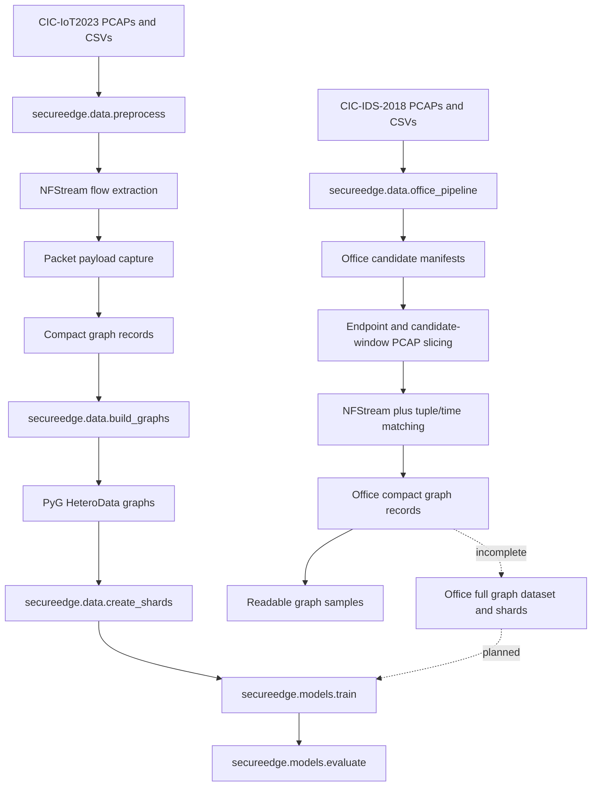
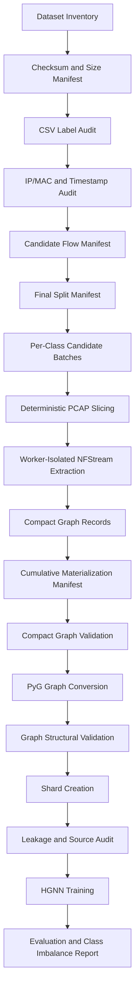

# CIC-IDS-2018 Preprocessing and Graph Generation Technical Report

Date generated: 2026-07-16

Repository root: `/var/home/alucard-00/EC499`

## Table of Contents

1. [Executive Summary](#1-executive-summary)
2. [Project Background and Context](#2-project-background-and-context)
3. [Project Goals and Expected Final Output](#3-project-goals-and-expected-final-output)
4. [Complete System Architecture](#4-complete-system-architecture)
5. [Repository Structure](#5-repository-structure)
6. [CIC-IDS-2018 Dataset Overview](#6-cic-ids-2018-dataset-overview)
7. [Data Acquisition and Dataset Selection](#7-data-acquisition-and-dataset-selection)
8. [Current Preprocessing Pipeline](#8-current-preprocessing-pipeline)
9. [Detailed Preprocessing Problems](#9-detailed-preprocessing-problems)
10. [IP and MAC Address Mapping](#10-ip-and-mac-address-mapping)
11. [Progress Toward Graph Generation](#11-progress-toward-graph-generation)
12. [Graph-Generation Design](#12-graph-generation-design)
13. [Current Graph-Generation Blockers](#13-current-graph-generation-blockers)
14. [Class Distribution and Class Imbalance](#14-class-distribution-and-class-imbalance)
15. [Web-Based Attack Class Imbalance](#15-web-based-attack-class-imbalance)
16. [Code Analysis](#16-code-analysis)
17. [Tools and Libraries](#17-tools-and-libraries)
18. [Environment and Reproducibility](#18-environment-and-reproducibility)
19. [Validation and Quality Checks](#19-validation-and-quality-checks)
20. [Current Project Status](#20-current-project-status)
21. [Gap Analysis](#21-gap-analysis)
22. [Recommended Next Steps](#22-recommended-next-steps)
23. [Proposed Improved Pipeline](#23-proposed-improved-pipeline)
24. [Example Commands and Execution Order](#24-example-commands-and-execution-order)
25. [Risks and Research Concerns](#25-risks-and-research-concerns)
26. [Final Conclusion](#26-final-conclusion)
27. [Appendices](#27-appendices)

## 1. Executive Summary

This repository contains a graph-based network intrusion detection project named SecureEdge. The stable, documented pipeline in `README.md`, `Project Context.md`, and the tracked `secureedge` package was originally built around CIC-IoT2023 PCAP and CSV data. It converts network flows into PyTorch Geometric heterogeneous graphs, trains an HGNN-style model, evaluates it, and prepares an export artifact.

The current repository also contains a newer and materially different CIC-IDS-2018 "office model" pipeline in `secureedge/data/office_pipeline.py` and many `context/64` through `context/86` notes. This office pipeline targets seven classes:

| Class | Source in office pipeline |
| --- | --- |
| Benign | CIC-IDS-2018 selected days |
| BruteForce | Wednesday-14-02-2018 |
| DoS | Friday-16-02-2018 |
| DDoS | Wednesday-21-02-2018 |
| WebBased | Thursday-22-02-2018, Friday-23-02-2018, plus CICIDS2017 Thursday augmentation for train only |
| Bot | Friday-02-03-2018 |
| Infiltration | Thursday-01-03-2018 |

The main original pipeline is able to generate graph files and shards. Evidence:

| Artifact | Current evidence |
| --- | --- |
| `artifacts/compact_reservoir_manifest.json` | 183,684 compact graph records, split-first-then-oversample strategy |
| `artifacts/graph_dataset_manifest.json` | 160,000 train graphs, 11,843 validation graphs, 11,841 test graphs |
| `artifacts/graph_shard_manifest.json` | 160 train shards, 12 validation shards, 12 test shards |
| `artifacts/metrics.json` | Not present; final model metrics could not be verified |

The CIC-IDS-2018 office pipeline has made substantial progress but is not yet at a complete graph-dataset stage. It has candidate manifests, final split manifests, targeted compact graph materialization, and readable graph samples. The current local office compact graph files contain:

| Office class | Materialized compact graph files |
| --- | ---: |
| Benign | 10,764 |
| BruteForce | 200 |
| DoS | 165 |
| DDoS | 20 |
| WebBased | 412 |
| Bot | 14,172 |
| Infiltration | 23,509 |

The most important unresolved problem is that full CIC-IDS-2018 office graph materialization is not complete. BruteForce, DoS, and DDoS were previously structurally blocked because the NFStream/PCAP materializer scanned huge endpoint captures without finding candidate-matching flows before resource limits. The targeted recovery work added candidate-window PCAP slicing and recovered enough graphs for readable samples, but it did not materialize the full target split. The office pipeline is therefore not ready for model training as a complete seven-class graph dataset.

The web-based attack class remains severely imbalanced. The office candidate split manifest reports only 412 native CIC-IDS-2018 WebBased candidates. It adds 167 CICIDS2017 WebBased candidates for training only and oversamples WebBased train references to 6,000. Validation and test still contain only 103 native WebBased samples each. This is a high-severity research and evaluation risk because model performance on WebBased attacks may be unstable and may not generalize beyond the small observed set.

Most critical next action: stabilize and finalize the CIC-IDS-2018 office materialization pipeline so that candidate manifests, compact graph files, cumulative materialization manifests, train/validation/test graph datasets, graph shards, and graph validation reports all agree.

## 2. Project Background and Context

The project addresses network intrusion detection: given packet captures and labeled traffic, it aims to identify attack traffic using graph-based machine learning. Intrusion-detection datasets are used because they provide packet or flow records with known attack labels, allowing supervised training and evaluation.

The repository contains evidence for two dataset tracks:

| Track | Evidence | Status |
| --- | --- | --- |
| CIC-IoT2023 / original SecureEdge | `README.md`, `Project Context.md`, `secureedge/config.py`, `CSV/`, `PCAPs/`, existing graph artifacts | Implemented and graph artifacts exist |
| CIC-IDS-2018 / office model | `datasets/cic_ids_2018/`, `secureedge/data/office_pipeline.py`, `context/64` through `context/86`, office artifacts | Partially implemented and under active recovery |

The user request focuses on CIC-IDS-2018, so this report treats the office pipeline as the target continuation path. The original SecureEdge pipeline is still important because the CIC-IDS-2018 work reuses the graph-building, packet-capture, training, and validation concepts from it.

The graph representation is flow-centric. The central implemented graph design is:

| Graph element | Implemented meaning |
| --- | --- |
| One graph | One network flow record with attached packet observations |
| Flow node | A single node containing NFStream-derived flow features plus temporal context |
| Packet nodes | Up to `FLOW_PACKET_LIMIT` packet payload nodes, each with up to 1,500 byte features |
| Flow-to-packet edges | Containment edges with direction, IP size, transport size, and payload size |
| Packet-to-flow edges | Reverse containment edges |
| Packet-to-packet edges | Temporal links between consecutive packets, with timestamp delta |
| Graph label | Class index derived from canonical class name |

The model component uses these heterogeneous graphs. `secureedge/models/hgnn.py` implements a multi-layer heterogeneous GNN using PyTorch Geometric `HeteroConv` and `GATv2Conv`. The intended machine-learning workflow is graph generation, graph sharding, HGNN training, evaluation, optional OOD detector training, and export.

## 3. Project Goals and Expected Final Output

The expected final system is an end-to-end, reproducible graph-generation and model-training pipeline for network intrusion detection.

Expected inputs:

| Input | Current source |
| --- | --- |
| Raw PCAP files | `PCAPs/` for original pipeline; `datasets/cic_ids_2018/raw_pcaps/` for office pipeline |
| Flow CSV files | `CSV/` for original pipeline; `datasets/cic_ids_2018/original_csv/` and `datasets/cic_ids_2018/improved_csv/` for office pipeline |
| Class and subtype mappings | `secureedge/config.py`, `secureedge/data/office_pipeline.py` |
| Attack windows and endpoint roles | `secureedge/data/office_pipeline.py`, context notes |

Expected preprocessing outputs:

| Output | Intended role |
| --- | --- |
| Candidate flow manifest | Lists selected labeled flows by class before graph materialization |
| Compact graph files | Lightweight per-flow graph records with arrays and metadata |
| Compact graph manifest | Cumulative count and provenance manifest for compact records |
| Full PyG graph files | `HeteroData` objects saved as `.pt` |
| Graph dataset manifest | Split counts, feature dimensions, scaler paths, class names |
| Graph shards | Batched `.pt` shard files for efficient training |
| Validation reports | Label, split, leakage, and graph-structure audits |

Expected final model workflow:

1. Acquire and validate dataset files.
2. Extract candidate labeled flows.
3. Materialize compact graphs from PCAP and flow metadata.
4. Convert compact graphs to PyTorch Geometric heterogeneous graphs.
5. Validate class distributions, graph structure, and split leakage.
6. Create shards.
7. Train HGNN.
8. Evaluate with macro metrics and class-specific reports.
9. Export deployment artifacts if evaluation is acceptable.

Current difference from desired state:

| Area | Current state | Desired state |
| --- | --- | --- |
| Original SecureEdge graph generation | Implemented; artifacts exist | Already usable, but metrics missing |
| CIC-IDS-2018 office candidate selection | Implemented | Needs final documentation and cumulative validation |
| CIC-IDS-2018 office compact materialization | Partial | Complete all target classes and splits |
| CIC-IDS-2018 office full graph dataset | Not confirmed | Complete `.pt` graphs, shards, and manifest |
| CIC-IDS-2018 office training | Not confirmed | Train and evaluate seven-class model |
| WebBased balance | Severe imbalance | Mitigated by documented, methodologically defensible strategy |

## 4. Complete System Architecture

### Actual Current Architecture



### Component Summary

| Component | Purpose | Input | Output | Files | Status |
| --- | --- | --- | --- | --- | --- |
| Configuration | Defines paths, classes, feature dimensions, guardrails | Environment variables and constants | Runtime settings | `secureedge/config.py` | Implemented for original pipeline |
| PCAP/flow extraction | Uses NFStream and packet callbacks to produce flow records with packet payloads | PCAP files | Flow dictionaries | `secureedge/data/pcap_flows.py` | Implemented; resource-sensitive |
| Original preprocessing | Discovers PCAPs, balances classes, handles split-first oversampling | `PCAPs/`, `CSV/` | Compact graph reservoir | `secureedge/data/preprocess.py`, `extract_worker.py` | Implemented with safety guards |
| Compact graph builder | Converts flow and packets into compact graph arrays | Flow features, packet records | Compact graph dict | `secureedge/data/graph_builder.py` | Implemented |
| Full graph conversion | Converts compact graph records to PyG `HeteroData` | Compact graph records | `.pt` graph files | `secureedge/data/build_graphs.py`, `graph_builder.py` | Implemented for original pipeline |
| Sharding | Groups graph files into training shards | Graph `.pt` files | Sharded `.pt` files | `secureedge/data/create_shards.py` | Implemented |
| Model | Heterogeneous GNN over flow and packet nodes | PyG graphs | Class logits | `secureedge/models/hgnn.py`, `train.py` | Implemented; final current metrics missing |
| Office candidate selection | Builds CIC-IDS-2018 candidate flows and splits | Office CSV files | Candidate manifests | `secureedge/data/office_pipeline.py` | Implemented |
| Office materialization | Matches candidate flows to PCAP-derived flows | Office PCAPs, candidates | Compact graph files | `secureedge/data/office_pipeline.py` | Partial |
| Office readable samples | Exports inspectable graph samples | Office compact graphs | Sample manifest and files | `secureedge/data/office_pipeline.py` | Implemented for 10/class |

## 5. Repository Structure

Important current structure:

```text
EC499/
├── README.md
├── FOLDER_STRUCTURE.md
├── Project Context.md
├── requirements.txt
├── CSV/
├── CSV.zip
├── PCAPs/
├── datasets/
│   └── cic_ids_2018/
│       ├── cic_ids_2017/
│       ├── improved_csv/
│       ├── original_csv/
│       └── raw_pcaps/
├── data/
│   └── graphs/
│       ├── office_compact/
│       ├── train/
│       ├── val/
│       ├── test/
│       ├── train_shards/
│       ├── val_shards/
│       └── test_shards/
├── artifacts/
│   ├── compact_reservoir_manifest.json
│   ├── graph_dataset_manifest.json
│   ├── graph_shard_manifest.json
│   └── office_model/
├── context/
├── docs/
│   └── CIC_IDS_2018_PREPROCESSING_AND_GRAPH_GENERATION_REPORT.md
├── secureedge/
│   ├── config.py
│   ├── data/
│   ├── features/
│   ├── models/
│   ├── ood/
│   ├── export/
│   └── visualize/
└── tests/
```

Directory and file roles:

| Path | Purpose | Current use | Status |
| --- | --- | --- | --- |
| `README.md` | Main project documentation for original SecureEdge pipeline | Used for execution order and methodology | Current for original pipeline; does not fully cover office work |
| `Project Context.md` | High-level status and run guidance | Useful historical context | Partly stale relative to office pipeline |
| `FOLDER_STRUCTURE.md` | Generated repository structure and artifact explanation | Useful orientation | Partly stale because office files and newer context notes are untracked |
| `requirements.txt` | Python dependency list | Used for environment setup | Present; lacks optional tooling such as `tcpdump`, `tshark` because those are system tools |
| `secureedge/config.py` | Central constants and original class mappings | Used by original graph pipeline | Implemented |
| `secureedge/data/office_pipeline.py` | CIC-IDS-2018 office candidate, materialization, diagnostics, sample export | Central to current user objective | Important but untracked at inspection time |
| `context/` | Development notes, run logs, methodology decisions | Evidence for historical progress and problems | Mixed tracked and untracked; important continuation guide |
| `datasets/cic_ids_2018/` | CIC-IDS-2018 and CICIDS2017 local dataset files | Used by office pipeline | Large local data, untracked |
| `artifacts/` | Generated manifests, scalers, metrics, model artifacts | Used to validate progress | Metrics missing; office compact manifest is not cumulative |
| `data/graphs/` | Generated graph data | Used for training and sample export | Original full graphs exist; office compact files exist partially |
| `tests/smoke_checks.py` | Smoke validation | Used after office recovery | Modified at inspection time |

No project-owned Jupyter notebooks or shell scripts were found by the repository scan outside vendored runtime files under `.uv-python`.

## 6. CIC-IDS-2018 Dataset Overview

The office pipeline encodes the selected CIC-IDS-2018 days in `secureedge/data/office_pipeline.py`. The selected days are:

| Capture date | Traffic types | Attack classes | Benign traffic | Current usage | Processing status |
| --- | --- | --- | --- | --- | --- |
| Wednesday-14-02-2018 | Office traffic with brute-force attacks | BruteForce | Yes | Candidate generation and targeted materialization | Partial compact materialization: 200 files |
| Friday-16-02-2018 | Office traffic with DoS attacks | DoS | Yes | Candidate generation and targeted materialization | Partial compact materialization: 165 files |
| Wednesday-21-02-2018 | Office traffic with DDoS attacks | DDoS | Yes | Candidate generation and targeted materialization | Partial compact materialization: 20 files |
| Thursday-22-02-2018 | Office traffic with web attacks | WebBased | Yes | Native WebBased candidates | 412 native WebBased total across web days |
| Friday-23-02-2018 | Office traffic with web attacks | WebBased | Yes | Native WebBased candidates | Included in WebBased pool |
| Friday-02-03-2018 | Office traffic with bot attacks | Bot | Yes | Candidate generation and materialization | 14,172 compact files |
| Thursday-01-03-2018 | Office traffic with infiltration attacks | Infiltration | Yes | Candidate generation and materialization | 23,509 compact files |

The office pipeline also references CICIDS2017 Thursday WebBased traffic for training-only augmentation. This is not the same dataset family as CIC-IDS-2018 and is treated separately in the split manifest to avoid validation/test contamination.

The project groups original labels into project classes. The original SecureEdge mapping in `secureedge/config.py` maps CIC-IoT-style labels such as `SqlInjection`, `XSS`, `BrowserHijacking`, `CommandInjection`, `Uploading_Attack`, and `Backdoor_Malware` into `WebBased`. The office pipeline has its own seven-class mapping and day-specific attack windows.

Relationship between files:

| File type | Role |
| --- | --- |
| Raw PCAP | Provides packet payloads, timestamps, IPs, ports, protocols, and MAC evidence when available |
| Original CSV | Provides baseline flow labels and CIC-IDS-2018 flow rows |
| Improved CSV | Provides larger/improved flow metadata used by office candidate selection |
| Candidate manifest | Stores selected flow candidates after label and split decisions |
| Compact graph record | Stores graph-ready arrays derived from PCAP packets and flow features |

This report did not verify external official CIC-IDS-2018 documentation. All dataset-day statements above are based on local repository code, paths, manifests, and context notes.

## 7. Data Acquisition and Dataset Selection

Local dataset evidence:

| Dataset area | Observed files |
| --- | --- |
| Original SecureEdge | `CSV/`, `CSV.zip`, `PCAPs/` |
| CIC-IDS-2018 original CSV | `datasets/cic_ids_2018/original_csv/*.csv` for selected days |
| CIC-IDS-2018 improved CSV | `datasets/cic_ids_2018/improved_csv/CSE-CICIDS2018_improved/*.csv` |
| CIC-IDS-2018 raw PCAP | `datasets/cic_ids_2018/raw_pcaps/<day>/pcap/...` |
| CICIDS2017 augmentation | `datasets/cic_ids_2018/cic_ids_2017/raw_pcaps/Thursday-WorkingHours.pcap` and improved Thursday CSV |

Observed large selected files include:

| File | Approximate size observed |
| --- | ---: |
| `datasets/cic_ids_2018/cic_ids_2017/raw_pcaps/Thursday-WorkingHours.pcap` | 8.3 GB |
| `datasets/cic_ids_2018/raw_pcaps/Friday-16-02-2018/pcap/UCAP172.31.69.25-part1.pcap` | 4.1 GB |
| `datasets/cic_ids_2018/raw_pcaps/Wednesday-21-02-2018/pcap/UCAP172.31.69.28 part 1` | 18 GB |

The current dataset selection is sufficient to represent the seven intended office classes at the candidate-manifest level. It is not yet sufficient at the fully materialized graph level because BruteForce, DoS, DDoS, and WebBased have far fewer compact graphs than their intended targets.

This information could not be confirmed from the current repository:

| Missing verification | Impact |
| --- | --- |
| Checksums for downloaded PCAP/CSV files | Cannot prove byte-for-byte dataset integrity |
| Exhaustive list of all downloaded PCAPs | Large `find` output is too broad; exact inventory should be generated as a manifest |
| Packet counts for all raw captures | Cannot confirm capture completeness |
| Failed or repeated download logs | Not present in a structured acquisition log |

## 8. Current Preprocessing Pipeline

### Original SecureEdge Pipeline

The documented command order is:

```bash
python -m secureedge.data.preprocess
python -m secureedge.data.build_graphs
python -m secureedge.features.pipeline
python -m secureedge.models.train
python -m secureedge.models.evaluate
python -m secureedge.ood.detector
python -m secureedge.export.export
```

Important stages:

| Stage | Script | Input | Output | Status |
| --- | --- | --- | --- | --- |
| Discover PCAP groups | `secureedge/data/preprocess.py` | `PCAPs/` | PCAP groups | Implemented |
| Extract flow records | `secureedge/data/pcap_flows.py`, `extract_worker.py` | PCAP files | Flow dictionaries with packets | Implemented; resource-sensitive |
| Canonicalize labels | `secureedge/data/preprocess.py`, `secureedge/config.py` | Source labels | Project classes | Implemented |
| Build compact graphs | `secureedge/data/graph_builder.py` | Flow and packet records | Compact graph records | Implemented |
| Split and oversample | `secureedge/data/preprocess.py` | Compact pool | Train/val/test compact paths | Implemented |
| Build PyG graphs | `secureedge/data/build_graphs.py` | Compact records | `.pt` graphs | Implemented |
| Create shards | `secureedge/data/create_shards.py` | `.pt` graph files | Shards | Implemented |
| Train model | `secureedge/models/train.py` | Shards/graphs | Checkpoint | Implemented; latest metrics absent |

Resource guard evidence from `secureedge/data/preprocess.py`:

```python
def assert_full_run_is_allowed(pcap_files: list[Path]) -> None:
    total_bytes = sum(path.stat().st_size for path in pcap_files)
    max_file_bytes = max((path.stat().st_size for path in pcap_files), default=0)
    full_methodology_count = total_requested_graphs() >= 100_000
    large_unsplit_corpus = total_bytes >= 10 * 1024**3 and max_file_bytes > config.PCAP_CHUNK_THRESHOLD_MB * 1024 * 1024
    if config.ALLOW_FULL_PREPROCESS:
        return
    if full_methodology_count or large_unsplit_corpus:
        raise RuntimeError(
            "Refusing to start full PCAP preprocessing without an explicit safety override. "
            f"This request would target {total_requested_graphs():,} graphs from "
            f"{total_bytes / (1024 ** 3):.2f} GiB of PCAP data, which has already exhausted "
            "system memory/swap on this workstation. For a bounded development run, set smaller "
            "sample counts, for example:\n\n"
            "  SECUREEDGE_TRAIN_SAMPLES_PER_CLASS=200 SECUREEDGE_TEST_SAMPLES_PER_CLASS=50 "
            "python -m secureedge.data.preprocess\n\n"
            "For the full final-methodology run, use a larger machine or a non-interactive batch "
            "environment and set SECUREEDGE_ALLOW_FULL_PREPROCESS=1 only when you are ready."
        )
```

This is important because it documents a real preprocessing failure mode: full PCAP processing previously exhausted memory/swap on the workstation. The implementation now requires explicit opt-in for full runs.

### CIC-IDS-2018 Office Pipeline

The office pipeline is centered in `secureedge/data/office_pipeline.py`.

Observed modes and responsibilities include:

| Mode or function area | Purpose | Output |
| --- | --- | --- |
| Preflight | Scan selected days, PCAP availability, CSV availability | `artifacts/office_model/preflight_manifest.json` |
| Candidate manifest | Select labeled candidate flows by class | `candidate_flow_manifest.json` |
| IP/time crosscheck | Validate expected windows and endpoints | Crosscheck artifact/context |
| WebBased attempted payload audit | Recover web attempts that labels miss or split incorrectly | `webbased_attempted_payload_audit.json` |
| CICIDS2017 WebBased augmentation | Add train-only web candidates | `cicids2017_webbased_augmentation_manifest.json` |
| Final office splits | Build class-balanced candidate split references | `final_candidate_split_manifest.json` |
| Compact materialization | Match candidates to PCAP-derived NFStream flows | `data/graphs/office_compact/...` |
| Readable graph samples | Export inspectable examples per class | `readable_graph_samples_manifest.json` |

The office pipeline has hard-coded day specs, attack windows, and endpoint roles. This is appropriate for a research recovery script but should be externalized into YAML/JSON before final reproducibility.

## 9. Detailed Preprocessing Problems

### Problem 1: Very Large PCAP Files and Memory Exhaustion

| Field | Details |
| --- | --- |
| Where | `secureedge/data/preprocess.py`, `secureedge/data/extract_worker.py`, `secureedge/data/office_pipeline.py` |
| Symptom | Full PCAP preprocessing can exhaust system memory/swap |
| Evidence | Runtime guard in `assert_full_run_is_allowed`; context notes about large PCAPs remaining blocked; office diagnostics around NFStream RSS |
| Root cause | NFStream and packet payload capture over multi-GB endpoint PCAPs create high memory pressure |
| Attempts | Safety guards, bounded sample counts, subprocess workers, memory checks, PCAP splitting, candidate slicing |
| Status | Mitigated, not eliminated |
| Effect on graph generation | Full graph generation must be chunked/sliced and resumable |
| Recommended solution | Use deterministic pre-slicing, worker isolation, manifest checkpointing, and batch-machine execution for full runs |

### Problem 2: Full Preprocessing Requires Explicit Safety Overrides

| Field | Details |
| --- | --- |
| Where | `secureedge/data/preprocess.py` |
| Symptom | Full run raises unless `SECUREEDGE_ALLOW_FULL_PREPROCESS=1` |
| Root cause | Prior full runs exhausted memory |
| Status | Intentional guard |
| Effect | Prevents accidental workstation failure but means final runs require explicit environment and hardware planning |

### Problem 3: Office BruteForce, DoS, and DDoS Materialization Initially Produced Zero Graphs

| Field | Details |
| --- | --- |
| Where | `context/bruteforce-dos-ddos-materialization-fix.md`, `context/85_office_missing_class_targeted_recovery.md`, `secureedge/data/office_pipeline.py` |
| Symptom | BruteForce, DoS, and DDoS were structurally blocked at `0 / 24,000` in earlier materialization state |
| Root cause | Candidate rows existed, but materialization did not find matching PCAP-derived flows before resource limits or scan failure |
| Attempts | Per-class endpoint selection, 5-tuple matching, candidate-window slicing, smaller DDoS time windows |
| Result | Recovered 200 BruteForce, 165 DoS, and 20 DDoS compact graphs |
| Status | Partially resolved |
| Effect | Readable samples can now cover all classes; full office graph dataset remains incomplete |
| Recommended solution | Generalize candidate-window slicing for full per-class materialization with cumulative manifests |

### Problem 4: DDoS Endpoint PCAP Too Large for Broad Slicing

| Field | Details |
| --- | --- |
| Where | `secureedge/data/office_pipeline.py`, context notes |
| Symptom | Broad IP-pair and 5-tuple DDoS slices remained too large or failed memory floor checks |
| Evidence | DDoS endpoint PCAP observed around 18 GB; narrowed candidate-window slice around 18 MB eventually succeeded for 20 graphs |
| Root cause | DDoS traffic volume and endpoint capture size |
| Status | Bounded recovery succeeded; full recovery not done |
| Recommended solution | Keep DDoS windows small, process candidates in deterministic batches, and merge compact outputs |

### Problem 5: WebBased Native Sample Scarcity

| Field | Details |
| --- | --- |
| Where | `artifacts/office_model/final_candidate_split_manifest.json`, `candidate_flow_manifest.json` |
| Symptom | Only 412 native CIC-IDS-2018 WebBased candidates |
| Root cause | Selected CIC-IDS-2018 web days provide far fewer usable web candidates than other office classes |
| Attempts | CICIDS2017 WebBased train-only augmentation; train oversampling |
| Status | Partially mitigated for training only |
| Effect | Validation/test reliability and generalization remain weak |
| Recommended solution | Add all available CIC-IDS-2018 web evidence first; keep CICIDS2017 as train-only or external-validation material; report macro metrics and confidence intervals |

### Problem 6: Office Compact Manifest Is Not Cumulative

| Field | Details |
| --- | --- |
| Where | `artifacts/office_model/office_compact_graph_manifest.json` |
| Symptom | Current manifest describes only the last targeted DDoS run, while filesystem contains many more office compact graphs |
| Root cause | Materialization manifest is overwritten per run |
| Status | Unresolved |
| Effect | Progress is hard to reproduce and audit |
| Recommended solution | Write cumulative manifest plus per-run manifests with stable run IDs |

### Problem 7: Critical Office Pipeline File Is Untracked

| Field | Details |
| --- | --- |
| Where | `secureedge/data/office_pipeline.py`, `git status --short` |
| Symptom | Office pipeline appears as untracked |
| Root cause | File has not been added to git |
| Status | Unresolved |
| Effect | Reproducibility risk; collaborators may not receive core CIC-IDS-2018 work |
| Recommended solution | Add and commit after review, or intentionally move experimental code under a documented experimental path |

### Problem 8: Documentation Drift Between Original and Office Pipelines

| Field | Details |
| --- | --- |
| Where | `README.md`, `Project Context.md`, `context/64` through `context/86` |
| Symptom | Main README describes CIC-IoT2023 final methodology, while current objective is CIC-IDS-2018 office graph generation |
| Root cause | New office pipeline added after original documentation |
| Status | Unresolved |
| Effect | New developers may run the wrong pipeline |
| Recommended solution | Add a dedicated office README and make this report a maintained project document |

### Problem 9: Metrics Artifact Missing

| Field | Details |
| --- | --- |
| Where | `artifacts/metrics.json` |
| Symptom | File is absent |
| Root cause | Current final evaluation either was not run or artifact was not preserved |
| Status | Unresolved |
| Effect | Model performance cannot be confirmed from repository state |
| Recommended solution | Re-run evaluation after graph dataset validation and store metrics with commit/dataset manifest hashes |

### Problem 10: Potential Label and Dataset Leakage Risks

| Field | Details |
| --- | --- |
| Where | `secureedge/data/preprocess.py`, `office_pipeline.py`, `leakage_audit.py` |
| Symptom | Split logic has leakage guards, but office work combines CIC-IDS-2018 and CICIDS2017 for WebBased training |
| Root cause | Scarce WebBased samples and dataset augmentation |
| Status | Partly controlled |
| Effect | Model could learn dataset-source artifacts instead of web attack behavior |
| Recommended solution | Keep CICIDS2017 out of validation/test, report source-stratified metrics, and consider external validation |

## 10. IP and MAC Address Mapping

### Why Mapping Matters

IP and MAC mapping is needed because raw network captures may include endpoint, gateway, broadcast, and duplicated host behavior. If graph construction uses endpoint identity directly, incorrect mapping can create wrong nodes, wrong edges, or leakage through host identity.

The implemented graph design does not create host nodes directly. It creates one flow node and packet nodes. However, source/destination IPs, MAC addresses, and candidate endpoint roles are still used for:

| Use | Impact |
| --- | --- |
| Candidate PCAP selection | Determines which endpoint PCAP is scanned |
| Attack filtering | Helps identify attacker/victim traffic |
| MAC filtering in original pipeline | Drops benign flows involving attacker MACs and attack flows without attacker MACs |
| Leakage audits | Detects split overlap or identity leakage |

### Original Pipeline MAC Filtering

`secureedge/data/extract_worker.py` applies class-conditional MAC filtering. Missing MACs are not automatically dropped. Benign records with attacker MACs are dropped; configured attack classes must involve attacker MACs unless missing-MAC fallback applies.

### Office Pipeline Endpoint Mapping

The office pipeline hard-codes attack windows and endpoint roles. A complete IP/MAC table could not be fully reconstructed from repository evidence without generating a dedicated manifest. The following table captures what is supported by inspected code and artifacts:

| Date | Role | IP address | MAC address | Evidence source | Confidence | Notes |
| --- | --- | --- | --- | --- | --- | --- |
| Wednesday-14-02-2018 | BruteForce endpoint | Day-specific private/public endpoint IPs | Not fully confirmed | `office_pipeline.py` attack windows and endpoint helpers | Medium | Compact recovery succeeded for 200 graphs |
| Friday-16-02-2018 | DoS endpoint | `172.31.69.25` observed in PCAP path | Not fully confirmed | PCAP path and office endpoint helpers | High for IP path | Compact recovery succeeded for 165 graphs |
| Wednesday-21-02-2018 | DDoS endpoint | `172.31.69.28` observed in PCAP path; rotating attacker IPs encoded | Not fully confirmed | PCAP path, `DDOS_ROTATING_ATTACKER_IPS` | High for endpoint path | Full capture is very large |
| Thursday-22-02-2018 | WebBased endpoint | Day-specific web windows | Not fully confirmed | `office_pipeline.py`, context web verification notes | Medium | Native WebBased scarce |
| Friday-23-02-2018 | WebBased endpoint | Day-specific web windows | Not fully confirmed | `office_pipeline.py` | Medium | Included in WebBased pool |
| Friday-02-03-2018 | Bot endpoint | Day-specific bot spec | Not fully confirmed | `office_pipeline.py` | Medium | 14,172 compact files exist |
| Thursday-01-03-2018 | Infiltration endpoint | Day-specific infiltration spec | Not fully confirmed | `office_pipeline.py` | Medium | 23,509 compact files exist |

Missing mapping evidence:

| Missing data | Consequence |
| --- | --- |
| Cumulative IP-to-MAC map per office day | Cannot prove stable host identity across days |
| Conflict report for one IP to multiple MACs | Cannot quantify NAT/gateway ambiguity |
| Conflict report for one MAC to multiple IPs | Cannot quantify host aliasing |
| Broadcast/multicast handling report | Cannot determine whether these appear in candidate graphs |

Recommended mapping work:

1. Generate `artifacts/office_model/ip_mac_map_by_day.json`.
2. Include per-day tables of IP, MAC, first timestamp, last timestamp, packet count, roles, and confidence.
3. Report conflicts explicitly.
4. Keep host identifiers out of model features unless justified, to reduce identity leakage.

## 11. Progress Toward Graph Generation

| Stage | Description | Status | Evidence | Remaining work |
| --- | --- | --- | --- | --- |
| Dataset acquisition | Local CIC-IDS-2018 CSV and PCAP files are present | Mostly complete | `datasets/cic_ids_2018/` | Generate checksums and complete inventory |
| Candidate selection | Office candidate flows selected by class | Mostly complete | `candidate_flow_manifest.json` | Validate all candidate-label assumptions |
| Final candidate split | Office train/val/test candidate references created | Mostly complete | `final_candidate_split_manifest.json` | Rebuild after final materialization policy if needed |
| WebBased augmentation | CICIDS2017 WebBased train-only augmentation | Experimental/partial | `cicids2017_webbased_augmentation_manifest.json` | Validate methodologically and report separately |
| PCAP parsing | NFStream and packet capture implemented | Partial | `pcap_flows.py`, targeted recovery output | Full office scale still blocked by resource limits |
| BruteForce materialization | Targeted recovery produced compact graphs | Partial | 200 compact files | Complete target split or justify lower target |
| DoS materialization | Targeted recovery produced compact graphs | Partial | 165 compact files | Complete target split or justify lower target |
| DDoS materialization | Narrow recovery produced compact graphs | Partial | 20 compact files | Scale safely |
| WebBased materialization | Native compact graphs exist | Partial | 412 compact files | Address scarcity |
| Bot materialization | Compact graphs exist | Partial/mostly complete | 14,172 compact files | Reach split target or update target |
| Infiltration materialization | Compact graphs exist | Partial/mostly complete | 23,509 compact files | Validate split coverage |
| Office graph conversion | Convert office compact records to full PyG split dataset | Not confirmed | No office full graph manifest found | Implement or run |
| Graph validation | Readable samples and smoke checks | Partial | 70 readable samples, smoke tests passed | Add cumulative graph validation |
| Model integration | Training code exists | Not started for office | `train.py`, `hgnn.py` | Create office graph manifests/shards |

## 12. Graph-Generation Design

The implemented graph-generation design is flow-centric, not time-window-centric.

Existing implementation from `secureedge/data/graph_builder.py`:

```python
def build_compact_graph_record(
    flow_features: dict[str, float],
    temporal_features: dict[str, float],
    packet_records: list[dict[str, object]],
    label: int,
    subtype_label: str,
    class_name: str,
    source_file: str,
    source_order: int,
) -> dict[str, object] | None:
    if not packet_records:
        return None

    feature_names, flow_values = ordered_flow_vector(flow_features, temporal_features)

    packet_rows: list[list[int]] = []
    contain_edge_rows: list[list[float]] = []
    timestamps: list[float] = []
    for packet in packet_records[: config.FLOW_PACKET_LIMIT]:
        payload = packet.get("payload", [])
        payload_values = [int(byte) & 0xFF for byte in payload]
        if len(payload_values) < config.N_PACKET_FEATURES:
            payload_values.extend([0] * (config.N_PACKET_FEATURES - len(payload_values)))
        packet_rows.append(payload_values[: config.N_PACKET_FEATURES])
        contain_edge_rows.append(
            [
                float(packet.get("direction", 0) or 0),
                float(packet.get("ip_size", 0) or 0),
                float(packet.get("transport_size", 0) or 0),
                float(packet.get("payload_size", 0) or 0),
            ]
        )
        timestamps.append(float(packet.get("timestamp_ms", 0) or 0))
```

Why this matters:

| Aspect | Design |
| --- | --- |
| One graph represents | One flow |
| Node definition | One flow node plus packet nodes |
| Edge definition | Flow contains packet; packet links to next packet |
| Edge direction | Directed hetero edge types |
| Node features | Flow features plus temporal features; raw payload bytes |
| Edge features | Direction and packet sizes; inter-packet delta |
| Label | Graph-level class index |
| Storage | Compact dict first, then PyG `HeteroData` `.pt` |

Pseudocode matching the current design:

```python
for candidate_flow in selected_candidates:
    pcap_flows = iter_flow_records(candidate_endpoint_pcap)
    matched_flow = match_by_tuple_and_timestamp(candidate_flow, pcap_flows)
    packet_records = matched_flow["packet_records"]
    compact = build_compact_graph_record(
        flow_features=matched_flow["flow_features"],
        temporal_features=matched_flow["temporal_features"],
        packet_records=packet_records,
        label=class_index,
        subtype_label=source_label,
        class_name=project_class,
        source_file=str(pcap_path),
        source_order=row_index,
    )
    save_compact_graph(compact)
```

The original pipeline has a complete compact-to-graph conversion. The office pipeline currently has compact graph records and readable samples but lacks a verified office-specific full graph dataset manifest and shards.

## 13. Current Graph-Generation Blockers

| Priority | Blocker | Affected component | Impact | Workaround | Recommended fix | Complexity |
| --- | --- | --- | --- | --- | --- | --- |
| Critical | Office compact materialization incomplete | `office_pipeline.py` | No complete seven-class office graph dataset | Use readable sample set only | Scale candidate-window slicing and resumable materialization | High |
| Critical | Office manifest is not cumulative | Office artifacts | Cannot audit true materialization state from one manifest | Count files on disk | Write cumulative and per-run manifests | Medium |
| High | WebBased native sample scarcity | Candidate split and training | Weak WebBased validation/test reliability | Train-only augmentation and oversampling | Add all CIC-IDS-2018 web evidence, source-stratified evaluation | Medium |
| High | Office pipeline untracked | Git/reproducibility | Core code may be lost or omitted | Local workspace only | Add and commit after review | Low |
| High | Full PCAP resource limits | PCAP parsing | Full materialization can fail | Narrow slices | Batch execution, chunking, memory caps, resume | High |
| Medium | Missing final metrics | Model evaluation | Cannot claim model performance | None | Re-run after validated graph generation | Medium |
| Medium | Documentation drift | Onboarding | Wrong pipeline may be run | Read context notes | Add office README/runbook | Low |

## 14. Class Distribution and Class Imbalance

### Original Graph Dataset Artifact Counts

These counts come from `artifacts/graph_dataset_manifest.json`.

| Project class | Train graphs | Val graphs | Test graphs | Source |
| --- | ---: | ---: | ---: | --- |
| Benign | 20,000 | 2,000 | 2,000 | Original graph manifest |
| DDoS | 20,000 | 2,000 | 2,000 | Original graph manifest |
| DoS | 20,000 | 2,000 | 2,000 | Original graph manifest |
| Mirai | 20,000 | 2,000 | 2,000 | Original graph manifest |
| Recon | 20,000 | 1,929 | 1,928 | Original graph manifest |
| Spoofing | 20,000 | 1,346 | 1,346 | Original graph manifest |
| WebBased | 20,000 | 386 | 385 | Original graph manifest |
| BruteForce | 20,000 | 182 | 182 | Original graph manifest |

This table uses graph counts, not packet or flow counts. Training is balanced by oversampling; validation and test expose real scarcity for WebBased and BruteForce.

### Office Candidate Split Counts

These counts come from `artifacts/office_model/final_candidate_split_manifest.json`.

| Office class | Candidate pool | Train real | Train target | Val | Test | Notes |
| --- | ---: | ---: | ---: | ---: | ---: | --- |
| Benign | 24,000 | 20,000 | 20,000 | 2,000 | 2,000 | Standard target |
| BruteForce | 24,000 | 20,000 | 20,000 | 2,000 | 2,000 | Candidate level only; compact materialization partial |
| DoS | 24,000 | 20,000 | 20,000 | 2,000 | 2,000 | Candidate level only; compact materialization partial |
| DDoS | 24,000 | 20,000 | 20,000 | 2,000 | 2,000 | Candidate level only; compact materialization partial |
| WebBased | 412 native + 167 CICIDS2017 train-only | 373 | 6,000 | 103 | 103 | Severe scarcity; train oversampled |
| Bot | 24,000 | 20,000 | 20,000 | 2,000 | 2,000 | Candidate level |
| Infiltration | 24,000 | 20,000 | 20,000 | 2,000 | 2,000 | Candidate level |

### Office Materialized Compact Counts

These counts come from the current `data/graphs/office_compact/` filesystem.

| Office class | Compact graph files | Approximate status |
| --- | ---: | --- |
| Benign | 10,764 | Partial |
| BruteForce | 200 | Targeted recovery sample |
| DoS | 165 | Targeted recovery sample |
| DDoS | 20 | Minimal targeted recovery sample |
| WebBased | 412 | All native candidates materialized or present |
| Bot | 14,172 | Partial |
| Infiltration | 23,509 | Near candidate target, needs split validation |

Exact packet counts and flow counts were not recalculated for this report. To calculate local label counts directly from CSV files, use a script that loads each selected CSV, normalizes the label column, and groups by original and project label. The resulting table must state whether the unit is CSV row, NFStream flow, compact graph, or full PyG graph.

## 15. Web-Based Attack Class Imbalance

The WebBased class is the most severe imbalance problem in the CIC-IDS-2018 office pipeline.

### Included Attacks

The original SecureEdge config maps the following labels to WebBased:

| Label | Project class |
| --- | --- |
| `SqlInjection` | WebBased |
| `XSS` | WebBased |
| `BrowserHijacking` | WebBased |
| `CommandInjection` | WebBased |
| `Uploading_Attack` | WebBased |
| `Backdoor_Malware` | WebBased |

The office pipeline includes WebBased traffic from Thursday-22-02-2018 and Friday-23-02-2018, with CICIDS2017 Thursday used as train-only augmentation.

### Current Counts

| Unit | WebBased count | Source |
| --- | ---: | --- |
| Native CIC-IDS-2018 candidate pool | 412 | Office final split manifest |
| CICIDS2017 train-only augmentation | 167 | Office final split manifest |
| Office train real WebBased | 373 | Office final split manifest |
| Office train target WebBased | 6,000 | Oversampled references |
| Office validation WebBased | 103 | Native only |
| Office test WebBased | 103 | Native only |
| Office compact WebBased files | 412 | Filesystem count |

Compared with standard office classes that have 24,000 candidate pool rows, the native WebBased pool is roughly 1.7% of a standard class candidate pool. Validation/test WebBased counts are only 103 each, making estimates of recall, precision, and F1 unstable.

### Why It Harms Training

The imbalance can harm the project at several levels:

| Level | Risk |
| --- | --- |
| Candidate flow level | WebBased may not cover enough attack variation |
| Compact graph level | Model sees repeated oversampled WebBased graphs |
| Batch level | Without balanced sampling, WebBased gradients may be rare |
| Evaluation level | 103 test graphs are too few for robust conclusions |
| Dataset-source level | CICIDS2017 augmentation may introduce source artifacts |

### CICIDS2017 Augmentation Validity

Using CICIDS2017 WebBased data is methodologically risky but can be defensible if clearly scoped.

Advantages:

| Advantage | Explanation |
| --- | --- |
| More web attack examples | Adds training exposure for payload and flow patterns |
| Train-only use limits direct leakage | Current manifest keeps CICIDS2017 out of val/test |
| May help representation learning | Model can learn broader web attack signatures |

Disadvantages:

| Disadvantage | Explanation |
| --- | --- |
| Dataset domain shift | Different capture environment, topology, tools, and traffic mix |
| Source leakage | Model may learn CICIDS2017-specific artifacts |
| Feature compatibility risk | CSV definitions and capture conditions may differ |
| Evaluation ambiguity | Improved performance may not reflect CIC-IDS-2018 generalization |

Recommended strategy:

1. Use all valid CIC-IDS-2018 WebBased candidates first.
2. Keep CICIDS2017 WebBased data train-only or use it for separate pretraining.
3. Do not include CICIDS2017 in CIC-IDS-2018 validation or test.
4. Use class-weighted or focal loss in addition to balanced sampling.
5. Report macro-F1, per-class recall, per-class precision, and confidence intervals.
6. Report WebBased results separately for native CIC-IDS-2018 and any external source.
7. Prefer graph-level random oversampling over SMOTE. SMOTE is not directly appropriate for heterogeneous graph objects unless applied to a carefully defined embedding space after validation.

Suitability of balancing methods:

| Method | Suitable? | Notes |
| --- | --- | --- |
| Download/use more CIC-IDS-2018 web data | Yes | Best first option if available |
| Combine compatible web subclasses | Yes | Already done conceptually; document labels |
| Class-weighted loss | Yes | Easy and defensible |
| Focal loss | Yes | Helpful when hard minority examples matter |
| Balanced batch sampling | Yes | Avoids minority starvation |
| Random oversampling | Yes, with caution | Already used; avoid duplicate leakage into val/test |
| Undersampling majority classes | Possibly | Reduces training data and may harm broad classes |
| SMOTE | Usually no for raw graphs | Only consider after embedding extraction |
| Synthetic graph generation | Experimental | High risk without validation |
| Threshold adjustment | Evaluation-stage only | Does not fix representation scarcity |
| Grouped split by capture day/source | Yes | Important for leakage control |
| Pretrain on CICIDS2017, fine-tune on CIC-IDS-2018 | Possibly | Cleaner than mixing if reported as transfer learning |

## 16. Code Analysis

### `secureedge/config.py`

Purpose: central configuration for original SecureEdge pipeline.

Important implementation:

```python
CLASS_NAMES = [
    "Benign",
    "DDoS",
    "DoS",
    "Mirai",
    "Recon",
    "Spoofing",
    "WebBased",
    "BruteForce",
]
CLASS_TO_INDEX = {name: idx for idx, name in enumerate(CLASS_NAMES)}
MAC_FILTERED_CLASSES = {name for name in CLASS_NAMES if name != "Benign"}
```

Inputs: environment variables and repository paths.

Outputs: constants used throughout preprocessing, graph generation, and training.

Problems:

| Problem | Impact |
| --- | --- |
| Original 8-class list differs from office 7-class list | Requires separate office mapping |
| Many environment variables control behavior | Needs reproducible config file |
| Hard-coded defaults | Good for local work but weak for experiments |

Recommended improvement: create `config/original.yaml` and `config/office_cic_ids_2018.yaml`, then load through a typed configuration layer.

### `secureedge/data/pcap_flows.py`

Purpose: wraps NFStream and packet capture plugins to produce flow records with packet payloads.

Main functions/classes:

| Name | Purpose |
| --- | --- |
| `extract_payload_bytes` | Extract payload bytes from packet object |
| `pad_payload` | Pad payload to fixed byte length |
| `PacketCapture` | Captures packet payload and metadata for each flow |
| `FlowCapper` | Stops collecting packets after limit |
| `iter_flow_records` | Yields flow records from PCAP |

Important behavior:

| Behavior | Impact |
| --- | --- |
| Packet records limited by `FLOW_PACKET_LIMIT` | Bounds graph size |
| `decode_tunnels=False` and `n_dissections=0` | Reduces NFStream overhead |
| Payload bytes stored as raw values | Enables packet-node byte features |

Known problems: NFStream over very large PCAP files can be memory-intensive. Candidate filtering must occur before or during PCAP reading whenever possible.

### `secureedge/data/graph_builder.py`

Purpose: convert flow and packet records into compact graph records and PyG `HeteroData`.

Main functions:

| Function | Purpose |
| --- | --- |
| `ordered_flow_vector` | Builds fixed-order flow feature vector |
| `build_compact_graph_record` | Builds compact dict with flow, packet, and edge arrays |
| `compact_to_hetero_graph` | Converts compact dict to PyG graph |
| `save_graph_dataset` | Writes graph split files and manifest |

Problems:

| Problem | Impact |
| --- | --- |
| Returns `None` for no-packet flows | Candidate counts can exceed graph counts |
| Raw byte features are high-dimensional | Training can be memory-heavy |
| Scaler fit assumes available training data | Need checks for office partial classes |

Recommended improvement: add a graph validation function that runs immediately after each compact write and after conversion.

### `secureedge/data/preprocess.py`

Purpose: original full preprocessing pipeline.

Key responsibilities:

| Responsibility | Evidence |
| --- | --- |
| Canonical label mapping | `canonical_label` |
| PCAP discovery | `discover_pcap_groups` |
| Safety gating | `assert_full_run_is_allowed` |
| Class balancing | `balance_records`, subtype balancing |
| Split-first oversampling | split logic documented in code and manifests |

Known problems: original pipeline is mature compared with the office pipeline, but it targets the original class scheme and dataset layout.

### `secureedge/data/extract_worker.py`

Purpose: worker subprocess for PCAP extraction and compact graph reservoir creation.

Important behavior:

| Behavior | Impact |
| --- | --- |
| Optional automatic PCAP splitting | Avoids huge single-PCAP runs when enabled |
| Memory checks | Stops unsafe runs |
| MAC filtering | Reduces label contamination |
| Reservoir sampling | Supports class-balanced sampling from large streams |

Known problems: worker failures must be surfaced in cumulative manifests. For office use, matching by candidate tuples and time windows is handled in `office_pipeline.py` instead.

### `secureedge/data/office_pipeline.py`

Purpose: CIC-IDS-2018 office-model candidate selection, split creation, diagnostics, compact graph materialization, and readable sample export.

Important constants:

| Constant area | Purpose |
| --- | --- |
| `OFFICE_DATASET_ROOT` | Root of local CIC-IDS-2018 data |
| `OFFICE_CLASS_NAMES` | Seven-class office label set |
| day specs | Selected capture days |
| attack windows | Date-specific attack timing and endpoints |
| WebBased augmentation paths | CICIDS2017 train-only augmentation |

Existing preflight blocker code:

```python
manifest = {
    "pipeline": "office_model_graph_generation",
    "status": "preflight_manifest",
    "target_graphs_per_class": 20000,
    "classes": OFFICE_CLASS_NAMES,
    "attack_classes": OFFICE_ATTACK_CLASSES,
    "dataset_root": str(OFFICE_DATASET_ROOT),
    "improved_csv_dir": str(OFFICE_IMPROVED_CSV_DIR),
    "raw_pcap_dir": str(OFFICE_RAW_PCAP_DIR),
    "days": days,
    "known_blockers": [
        "Full PCAP graph extraction is intentionally not started by preflight; run it only after manifest counts and label gates pass.",
        "CICIDS2017 WebBased augmentation is still not merged into the CIC-IDS2018 candidate manifest.",
    ],
}
```

This code is important because it shows the office pipeline was intentionally staged. The second blocker is now partly outdated because the final split manifest includes CICIDS2017 train-only augmentation; the preflight text should be refreshed.

Problems:

| Problem | Impact |
| --- | --- |
| File is untracked | High reproducibility risk |
| Many hard-coded paths/windows | Hard to reproduce outside this workspace |
| Large monolithic file | Hard to review and test |
| Per-run compact manifest overwrite | Loses cumulative progress view |
| Full office graph conversion not verified | Blocks training |

Recommended improvement: split into modules: `office_config.py`, `office_candidates.py`, `office_slicing.py`, `office_materialize.py`, `office_validate.py`, and `office_samples.py`.

### `secureedge/models/hgnn.py`

Purpose: heterogeneous graph model.

Main components:

| Component | Role |
| --- | --- |
| Packet encoder | Encodes packet byte features |
| Heterogeneous convolutions | Processes flow-packet graph relations |
| Readout | Pools graph node representations |
| Classifier | Produces class logits |

Status: implemented. It can be reused for office graphs once office graph manifests use the correct class mapping and dimensions.

### `secureedge/models/train.py`

Purpose: training loop for generated graph datasets or shards.

Important features:

| Feature | Evidence |
| --- | --- |
| Device selection | CPU/CUDA/MPS selection logic |
| AMP handling | Raw graph mode disables AMP to avoid overflow |
| Shard loading | Uses graph shard manifest when present |
| Class metrics | Per-class evaluation functions |
| Checkpoint compatibility | Model signature checks |

Status: implemented for original pipeline. Office use requires a valid office graph dataset/shard manifest and class mapping.

### `tests/smoke_checks.py`

Purpose: lightweight project validation. It was modified during office recovery and passed after targeted missing-class recovery.

Status: useful but not sufficient. It should be expanded into separate tests for candidate manifests, compact graph records, split leakage, and office class coverage.

## 17. Tools and Libraries

| Tool/library | Found in | Purpose | Notes |
| --- | --- | --- | --- |
| Python 3.11 | `.uv-python`, code syntax | Main implementation language | `.uv-python` indicates local runtime |
| PyTorch | `requirements.txt`, model code | Tensor operations and model training | Required |
| PyTorch Geometric | `requirements.txt`, graph builder/model | `HeteroData`, graph loaders, hetero convs | Required |
| `torch-scatter`, `torch-sparse`, `torch-cluster` | `requirements.txt` | PyG compiled dependencies | Install can be platform-sensitive |
| NFStream | `requirements.txt`, `pcap_flows.py` | Flow extraction from PCAP | Central preprocessing dependency |
| pandas | `requirements.txt`, office/original pipelines | CSV processing | Required |
| NumPy | `requirements.txt`, graph arrays | Numeric arrays | Required |
| scikit-learn | `requirements.txt`, scalers/metrics | StandardScaler, metrics | Required |
| joblib | `requirements.txt` | Save scalers | Required |
| tqdm | `requirements.txt` | Progress bars | Required |
| tcpdump | Office slicing code/context | PCAP filtering/slicing fallback | System dependency, not in requirements |
| Git | repo metadata | Version control and history | Many office files untracked |

No project-owned Jupyter notebooks or shell scripts were found.

## 18. Environment and Reproducibility

Recommended setup from repository evidence:

```bash
python -m venv .venv
source .venv/bin/activate
pip install -r requirements.txt
```

System requirements:

| Requirement | Reason |
| --- | --- |
| Linux environment | Paths and PCAP tooling assume Linux-like filesystem |
| Sufficient RAM/swap | NFStream over large PCAPs is memory-intensive |
| `tcpdump` | Used by office slicing fallback |
| Large disk capacity | PCAPs, compact graphs, and PyG graphs are large |

Important environment variables:

| Variable | Purpose |
| --- | --- |
| `SECUREEDGE_ALLOW_FULL_PREPROCESS` | Allows original full preprocessing |
| `SECUREEDGE_TRAIN_SAMPLES_PER_CLASS` | Original training target |
| `SECUREEDGE_VAL_SAMPLES_PER_CLASS` | Original validation target |
| `SECUREEDGE_TEST_SAMPLES_PER_CLASS` | Original test target |
| `SECUREEDGE_FLOW_PACKET_LIMIT` | Packet nodes per graph |
| `SECUREEDGE_OFFICE_PRESLICE_TIME_WINDOW_SECONDS` | Office candidate-window slicing width |
| `SECUREEDGE_ALLOW_FULL_OFFICE_MATERIALIZATION` | Allows full office materialization |

Reproducibility gaps:

| Gap | Recommended fix |
| --- | --- |
| Office pipeline untracked | Add to git |
| No checksums | Generate dataset checksum manifest |
| Hard-coded office paths/windows | Move to config file |
| Non-cumulative office manifest | Add cumulative materialization manifest |
| Missing final metrics | Re-run evaluation and save metrics |

## 19. Validation and Quality Checks

Current validation evidence:

| Validation | Evidence | Status |
| --- | --- | --- |
| Original graph manifest dimensions | `artifacts/graph_dataset_manifest.json` | Present |
| Original graph shards | `artifacts/graph_shard_manifest.json` | Present |
| Split-first oversampling | Original compact manifest | Present |
| Office final split leakage guard | `final_candidate_split_manifest.json` reports no CICIDS2017 in val/test and no real candidate cross-split identity overlap | Present |
| Office readable class coverage | `readable_graph_samples_manifest.json` has 70 samples, 10 per class, no missing classes | Present |
| Smoke checks | `.venv/bin/python tests/smoke_checks.py` passed after recovery | Present |

Validation still required:

| Check | Why |
| --- | --- |
| PCAP checksum and packet-count manifest | Confirm raw input integrity |
| CSV label-count manifest | Confirm candidate source distribution |
| Per-day timestamp range validation | Prevent time-window mismatch |
| IP/MAC conflict audit | Prevent endpoint identity ambiguity |
| Office compact cumulative count validation | Confirm graph availability |
| Office graph structural validation | Detect empty graphs, self-loops, duplicate edges, bad dimensions |
| Office split graph validation | Ensure no duplicated graph identities across splits |
| Source leakage validation | Especially for CICIDS2017 augmentation |
| Final model evaluation | Produce per-class and macro metrics |

Example proposed validation code:

```python
from pathlib import Path
import torch

root = Path("data/graphs/office_compact")
counts = {}
for path in root.rglob("*.pt"):
    cls = path.parent.name
    counts[cls] = counts.get(cls, 0) + 1
    record = torch.load(path, map_location="cpu", weights_only=False)
    assert record["packet_x_uint8"].shape[1] == 1500
    assert record["flow_x"].shape[0] == 92
print(counts)
```

## 20. Current Project Status

| Question | Answer |
| --- | --- |
| What has been completed? | Original graph dataset generation and sharding; office candidate manifests; office final candidate splits; office readable samples with all seven classes |
| What is working? | Compact graph building, original graph conversion, original sharding, HGNN code, targeted office recovery |
| What is partially working? | CIC-IDS-2018 office compact materialization |
| What is untested? | Full office graph conversion, office training, final office evaluation |
| What is failing? | No current hard failure observed after targeted recovery, but full office materialization remains incomplete |
| What is blocked? | Complete office graph dataset and training readiness |
| Can the project currently generate graphs? | Yes for original pipeline; yes partially for office compact graphs; not confirmed for complete office full graph dataset |
| Are generated graphs valid and usable? | Original graph artifacts appear structurally ready; office readable samples are usable for inspection, not full training |
| Is the project ready for model training? | Original pipeline likely yes if metrics/checkpoints are available; office pipeline no |

Approximate completion by stage:

| Stage | Assessment |
| --- | --- |
| Original SecureEdge preprocessing | Complete enough to produce artifacts |
| Original graph generation | Complete enough to produce train/val/test graphs |
| Original model evaluation | Unknown because metrics artifact missing |
| Office candidate selection | Mostly complete |
| Office compact materialization | Partial |
| Office full graph generation | Not confirmed |
| Office model training | Not started or not verifiable |

## 21. Gap Analysis

| Requirement | Current implementation | Gap | Severity | Required action |
| --- | --- | --- | --- | --- |
| Reproducible CIC-IDS-2018 pipeline | `office_pipeline.py` and context notes | File untracked and monolithic | Critical | Add, split, document |
| Complete seven-class office graph dataset | Partial compact files | Missing full class targets | Critical | Finish materialization |
| Cumulative materialization tracking | Per-run manifest overwritten | Cannot audit progress | High | Add cumulative manifest |
| WebBased representation | 412 native candidates | Severe imbalance | High | Use all native data, train-only augmentation, weighted training |
| Full office PyG graph conversion | Not verified | Cannot train | High | Build office graph conversion command |
| Final evaluation | Metrics missing | Cannot report performance | High | Re-run evaluation |
| Dataset integrity | Local files present | No checksums | Medium | Generate checksums |
| IP/MAC mapping | Inferred/hard-coded | No complete conflict report | Medium | Generate mapping audit |
| Documentation | Original README plus context | Drift | Medium | Add office runbook |

## 22. Recommended Next Steps

### Phase 1: Stabilize Preprocessing

| Task | Priority | Dependencies | Expected input | Expected output | Validation | Files |
| --- | --- | --- | --- | --- | --- | --- |
| Commit or explicitly archive office pipeline | Critical | Review current file | `office_pipeline.py` | Tracked code | Git status clean for pipeline | `secureedge/data/office_pipeline.py` |
| Add cumulative office materialization manifest | Critical | Current compact files | Compact graph directory | `office_compact_cumulative_manifest.json` | Counts match filesystem | `office_pipeline.py` |
| Externalize office day/window config | High | Current constants | Hard-coded specs | YAML/JSON config | Config loads to same candidates | New `config/office_cic_ids_2018.yaml` |

### Phase 2: Validate Labels and Mappings

| Task | Priority | Dependencies | Expected output |
| --- | --- | --- | --- |
| Generate CSV label-count report | High | Selected CSVs | Original/project label counts |
| Generate IP/MAC map per day | High | Raw PCAPs | Mapping conflict report |
| Validate candidate timestamp windows | High | CSVs and PCAP windows | Time-window audit |
| Validate CICIDS2017 train-only separation | High | Final split manifest | Source leakage report |

### Phase 3: Complete Feature Generation

| Task | Priority | Output |
| --- | --- | --- |
| Confirm all compact graphs have 92 flow features and 1,500 packet bytes | High | Feature validation report |
| Check missing/infinite feature values | High | Feature quality report |
| Confirm edge dimensions | Medium | Graph schema report |

### Phase 4: Generate Graphs

| Task | Priority | Output |
| --- | --- | --- |
| Materialize remaining office compact graphs by class | Critical | Complete compact graph pool |
| Convert office compact graphs to PyG graphs | Critical | Office `train/val/test` graph directories |
| Create office graph shards | High | Office shard manifest |

### Phase 5: Validate Generated Graphs

| Task | Priority | Output |
| --- | --- | --- |
| Structural graph validation | Critical | Node/edge/dimension report |
| Split leakage audit | Critical | Duplicate and source leakage report |
| Class distribution audit | High | Counts by split/class/source |

### Phase 6: Address Class Imbalance

| Task | Priority | Output |
| --- | --- | --- |
| Decide WebBased target policy | Critical | Documented target counts |
| Use class-weighted or focal loss | High | Training config |
| Use balanced batches | High | Training loader config |
| Report macro metrics and WebBased confidence | High | Evaluation report |

Phase 6 implementation status as of 2026-07-29:

| Item | Current state |
| --- | --- |
| WebBased target policy | Use all materialized real WebBased graphs; keep validation/test native-only; use CICIDS2017 train-only data only when materialized |
| Materialized WebBased split counts | Train 206, validation 103, test 103 |
| CICIDS2017 train-only shortfall | 167 configured train-only WebBased references did not materialize into the current graph dataset |
| Training loss | `weighted_cross_entropy` with effective-number train-only class weights, `beta=0.9999`, max weight `8.0` |
| Current WebBased loss weight | `6.13131` from the current train split only |
| Balanced batches | Enabled with `weighted_random_sampler`, replacement, inverse-class-frequency sample weights |
| Training config source | `configs/office_cic_ids_2018.yaml` `imbalance` section |
| Audit artifact | `artifacts/office_model/office_imbalance_policy.json` |

The current imbalance handling is training-only. Validation and test counts are not used for class weights or sampler weights, and the test split remains unloaded during training.

### Phase 7: Integrate With the Model

| Task | Priority | Output |
| --- | --- | --- |
| Add office class mapping to training config | High | Seven-class model run |
| Train office model | High | Checkpoint |
| Evaluate office model | High | `metrics.json` and classification report |
| Export only after validation | Medium | Export artifact |

## 23. Proposed Improved Pipeline



Design requirements:

| Requirement | Proposed implementation |
| --- | --- |
| Scalability | Process candidate batches and PCAP slices, not entire endpoint PCAPs |
| Memory usage | Worker subprocesses with strict RSS limits |
| Resume support | Per-batch manifests and cumulative manifest |
| Reproducibility | Config files and checksum manifests |
| Logging | Structured JSONL run logs |
| Error handling | Defer failed candidates with reason codes |
| Validation | Validate after every stage |
| Class balance | Separate real counts from oversampled references |
| Dataset splitting | Split before oversampling; group by source/day where needed |

## 24. Example Commands and Execution Order

Actual original pipeline commands:

```bash
python -m secureedge.data.preprocess
python -m secureedge.data.build_graphs
python -m secureedge.data.create_shards
python -m secureedge.models.train
python -m secureedge.models.evaluate
```

Actual office commands are mode-based through `secureedge.data.office_pipeline`. Exact mode flags should be confirmed with `--help` in the local workspace. Based on repository evidence, the intended order is:

```bash
# 1. Preflight selected CIC-IDS-2018 days
python -m secureedge.data.office_pipeline --mode preflight

# 2. Build candidate flow manifest
python -m secureedge.data.office_pipeline --mode candidate-manifest

# 3. Validate IP and time assumptions
python -m secureedge.data.office_pipeline --mode ip-time-crosscheck

# 4. Audit/recover WebBased attempted payloads
python -m secureedge.data.office_pipeline --mode webbased-attempted-check

# 5. Add CICIDS2017 WebBased train-only augmentation
python -m secureedge.data.office_pipeline --mode cicids2017-webbased-augment

# 6. Build final candidate splits
python -m secureedge.data.office_pipeline --mode office-final-splits

# 7. Materialize compact graphs
python -m secureedge.data.office_pipeline --mode office-materialize-compact

# 8. Export readable samples
python -m secureedge.data.office_pipeline --mode office-readable-graph-samples
```

Proposed commands not yet confirmed as implemented:

```bash
# Proposed: build cumulative office manifest
python -m secureedge.data.office_pipeline --mode office-cumulative-manifest

# Proposed: validate office compact graph pool
python -m secureedge.data.office_pipeline --mode office-validate-compact

# Proposed: convert office compact records to PyG graphs
python -m secureedge.data.office_pipeline --mode office-build-graphs

# Proposed: shard office graphs
python -m secureedge.data.create_shards --manifest artifacts/office_model/office_graph_dataset_manifest.json
```

## 25. Risks and Research Concerns

| Risk | Severity | Mitigation |
| --- | --- | --- |
| Incorrect traffic labels | Critical | Cross-check CSV labels, attack windows, endpoints, and PCAP matches |
| Data leakage | Critical | Split before oversampling; audit duplicate candidate identities |
| Dataset-source leakage | High | Keep CICIDS2017 out of validation/test; source-stratified reports |
| WebBased scarcity | High | Use all native web data, weighted loss, balanced batches, careful metrics |
| Overfitting to IP/MAC identity | High | Avoid identity features; audit endpoint dependence |
| Capture-day leakage | High | Consider grouped split by day/source for robustness experiments |
| Temporal leakage | Medium | Validate time windows and split rules |
| Graph-construction bias | Medium | Compare flow-centric design against time-window alternatives |
| Excessive graph size | Medium | Keep packet limit and shard graphs |
| Loss of temporal detail | Medium | Preserve packet-link deltas and consider window-level features |
| Inconsistent preprocessing | High | Centralize config and version manifests |
| Missing reproducibility artifacts | High | Add checksums, run configs, and cumulative manifests |

## 26. Final Conclusion

SecureEdge has a functioning graph-based intrusion-detection architecture: PCAP and flow processing, compact graph construction, PyTorch Geometric graph conversion, sharding, HGNN training code, and evaluation code are all present. The original pipeline has already produced train/validation/test graph artifacts and shards.

The CIC-IDS-2018 office-model pipeline is promising but incomplete. Candidate selection, split creation, WebBased augmentation, targeted missing-class recovery, and readable graph samples exist. However, full office compact graph materialization has not reached the intended class targets, and a complete office PyG graph dataset with shards and evaluation metrics could not be verified.

The biggest preprocessing problems are large endpoint PCAPs, NFStream memory pressure, difficult candidate-to-PCAP matching for BruteForce/DoS/DDoS, non-cumulative manifests, and severe WebBased class imbalance. The most critical next step is to stabilize office materialization with deterministic candidate-window slicing and cumulative validation, then convert the resulting compact records into a validated graph dataset.

Graph generation is currently possible for the original pipeline and partially possible for CIC-IDS-2018 office compact graphs. It is not yet ready to produce final CIC-IDS-2018 office training results.

## 27. Appendices

### Appendix A: Dependency List From `requirements.txt`

```text
torch>=2.1.0
torch-geometric>=2.4.0
torch-scatter
torch-sparse
torch-cluster
nfstream>=6.3.3
scikit-learn>=1.3.0
numpy>=1.24.0
pandas>=2.0.0
joblib>=1.3.0
tqdm>=4.65.0
```

### Appendix B: Important Artifact Paths

| Path | Meaning |
| --- | --- |
| `artifacts/compact_reservoir_manifest.json` | Original compact graph manifest |
| `artifacts/graph_dataset_manifest.json` | Original PyG graph manifest |
| `artifacts/graph_shard_manifest.json` | Original shard manifest |
| `artifacts/office_model/candidate_flow_manifest.json` | Office candidate manifest |
| `artifacts/office_model/final_candidate_split_manifest.json` | Office final candidate split manifest |
| `artifacts/office_model/webbased_attempted_payload_audit.json` | WebBased recovery audit |
| `artifacts/office_model/cicids2017_webbased_augmentation_manifest.json` | CICIDS2017 augmentation manifest |
| `artifacts/office_model/readable_graph_samples_manifest.json` | Office readable sample manifest |
| `data/graphs/office_compact/` | Office compact graph records |

### Appendix C: Glossary

| Term | Meaning |
| --- | --- |
| Compact graph | Lightweight graph record containing arrays and metadata before PyG conversion |
| Flow node | Graph node representing a network flow |
| Packet node | Graph node representing packet payload bytes associated with a flow |
| Heterogeneous graph | Graph with multiple node and edge types |
| NFStream | Library used to extract flow statistics from PCAP files |
| PCAP | Packet capture file |
| Candidate flow | CSV-derived labeled flow selected for graph materialization |
| Materialization | Process of matching a candidate flow to PCAP-derived packets and saving a compact graph |
| Oversampling | Reusing minority-class training examples to balance training counts |
| Source leakage | Model exploiting dataset/capture-source artifacts rather than attack behavior |
| Split leakage | Same or equivalent sample appearing in multiple train/validation/test splits |

### Appendix D: Key Evidence Line References

The following line references were inspected directly from the current workspace and support the main conclusions in this report. Line numbers may shift after future edits.

| Evidence | File and line range | Conclusion supported |
| --- | --- | --- |
| Original eight-class label set and subtype mapping | `secureedge/config.py:117-177` | The tracked original pipeline targets `Benign`, `DDoS`, `DoS`, `Mirai`, `Recon`, `Spoofing`, `WebBased`, and `BruteForce`, with web labels grouped into `WebBased` |
| Original split target environment variables | `secureedge/config.py:179-188` | Train/validation/test targets are controlled by environment variables |
| Memory/full-run guard | `secureedge/data/preprocess.py:168-186` | Full PCAP preprocessing is intentionally blocked without explicit override because prior runs exhausted memory/swap |
| Compact graph construction | `secureedge/data/graph_builder.py:86-151` | One graph is built from one flow vector plus packet payload nodes and edge attributes |
| Office preflight known blockers | `secureedge/data/office_pipeline.py:4339-4355` | Office graph generation was intentionally staged and full extraction was not launched by preflight |
| BruteForce/DoS/DDoS structural blockage note | `context/bruteforce-dos-ddos-materialization-fix.md:21-23` | Missing office classes were previously blocked at zero materialized graphs |
| CUDA training blocker from earlier run | `context/23_hgnn_training_phase_validation.md:205` | Historical training validation noted CUDA driver limitations |
| Deprecated architecture warning | `context/secureedge_methodology_final.md:477` | `secureedge/models/architecture.py` is documented as deprecated |
| Large PCAP guard context | `context/14_safe_small_pcap_extraction_run.md:48` | Previous small extraction excluded large unsplit PCAPs and deferred them to splitting/batch processing |

### Appendix E: Current Git/Reproducibility Snapshot

At inspection time, `git status --short` showed many modified context and source files plus numerous untracked office-context documents, `datasets/`, and `secureedge/data/office_pipeline.py`. This matters because the most relevant CIC-IDS-2018 office implementation is present in the working tree but not confirmed as committed repository history.

Important untracked or modified areas:

| Area | Reproducibility implication |
| --- | --- |
| `secureedge/data/office_pipeline.py` untracked | Core office pipeline may not exist for a fresh clone |
| `datasets/` untracked | Local dataset state is not represented by git |
| `context/64` through `context/86` mostly untracked | Office development history may not travel with the repository |
| Modified tracked files under `secureedge/` | Current behavior may differ from last commit |

Recommended action: commit the intended source and documentation state after review, while keeping large datasets and generated graph artifacts out of git but represented by checksum and manifest files.
